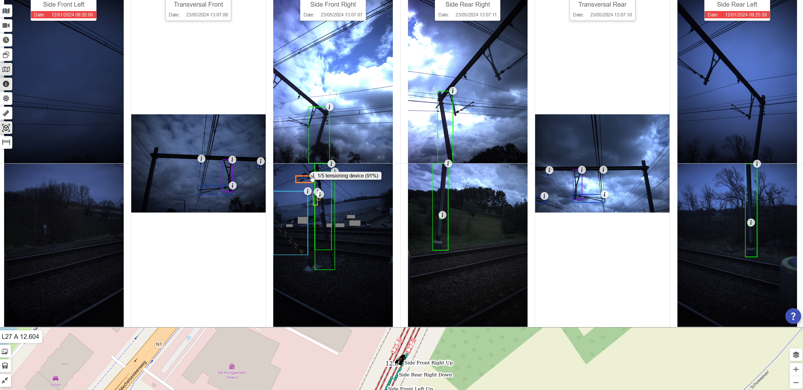

public:: true
type:: [[Project]]
description:: A backend processing system to identify railway assets on pictures taken by camera's on measurement trains. The results help in creating inventories and manual digital inspection. The goal is to also categorize assets according to their state (health/worn..)
has-category:: Image processing
has-tagged-techniques:: #[[Image recognition AI]], #[[C#]], #Railway, #Postgresql, #Dbeaver, #S3
has-tagged-roles:: #[[Business analyst]], #[[Data analyst]]
has-linked-projects:: #[[Measurement train image post processing]]
is-featured:: Yes
during-job:: #[[Job: Project lead digitalisation linear assets]]

- 