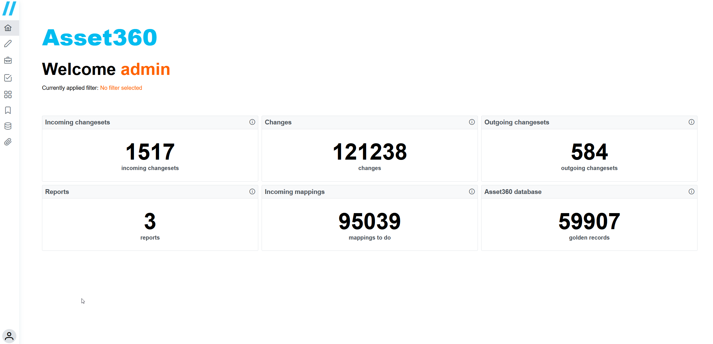
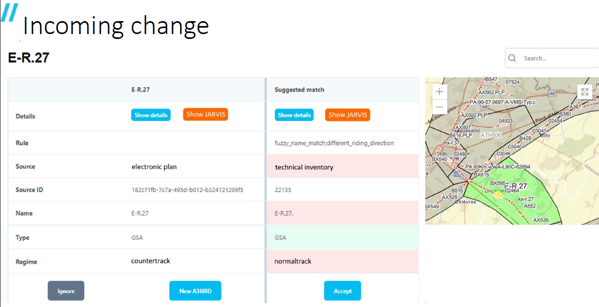
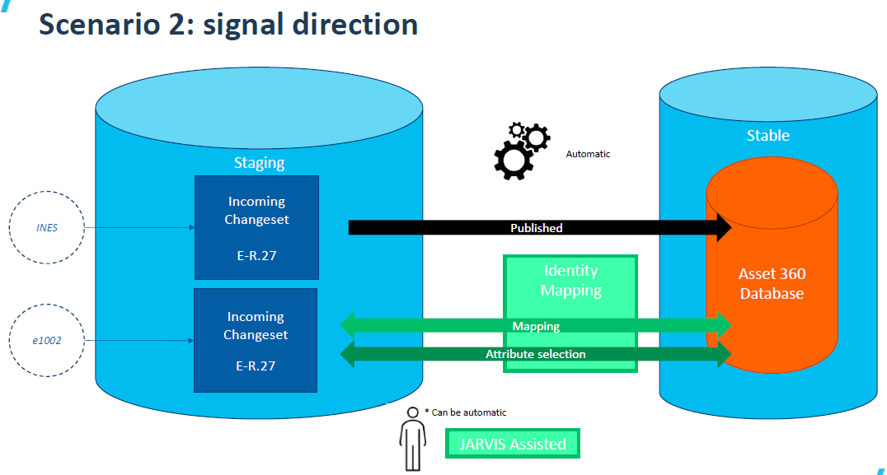
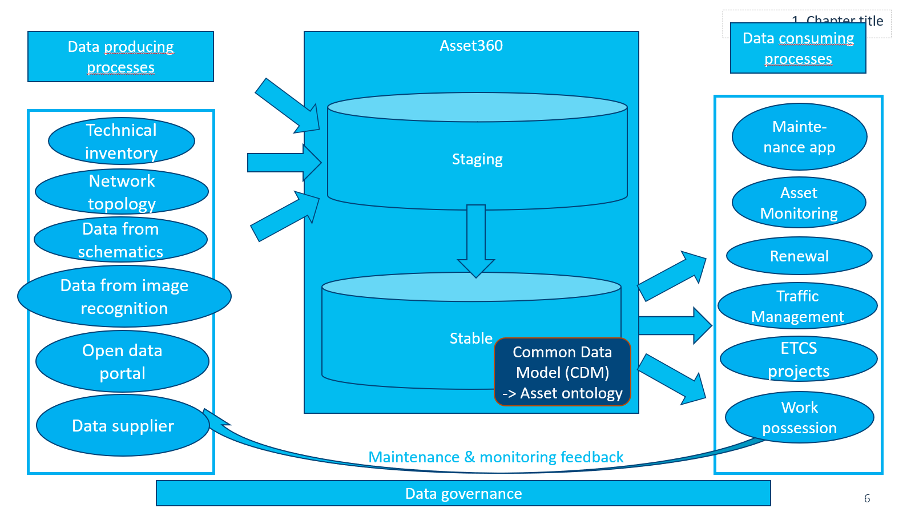
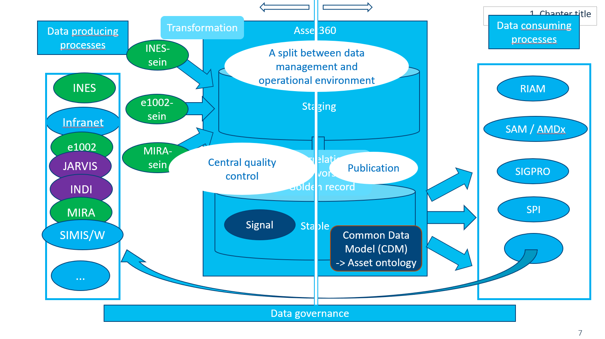

public:: true
type:: [[Project]]
description:: A data platform combining all asset data, setting the golden record and creating the foundation for a data centric landscape.
has-category:: Data platform
has-tagged-techniques:: #Python, #[[Data centricity]], #Railway, #Postgresql, #Dbeaver, #[[Data centric strategy]], #[[Data governance]]
has-tagged-roles:: #[[Business analyst]], #[[Product owner]]
has-linked-projects:: #[[Data centric strategy]], #[[Enterprise data governance model]]
is-featured:: Yes
during-job:: #[[Job: Teamlead data centricity]]

- 
- 
- 
- 
- 