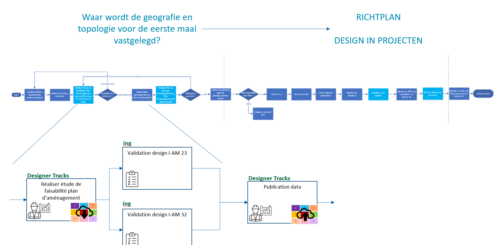
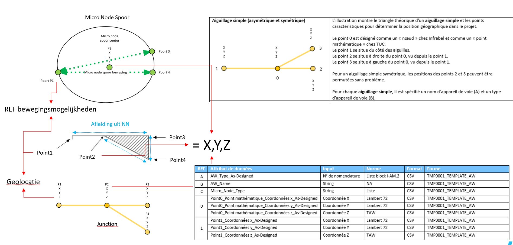

public:: true
type:: [[Project]]
description:: Track layout is one of those fundamental asset data sources on which most other railway assets depend. Having a healthy data delivery of this information is therefor required. This project implemented changes in the business process to accommodate this data delivery.
has-category:: Business process
has-tagged-techniques:: #LandXML, #[[AutoCAD suite]], #Railway
has-tagged-roles:: #[[Business analyst]], #[[Data architect]] 
has-linked-projects:: #Asset360 
is-featured:: Yes
during-job:: #[[Job: Teamlead data centricity]]

- 
- 