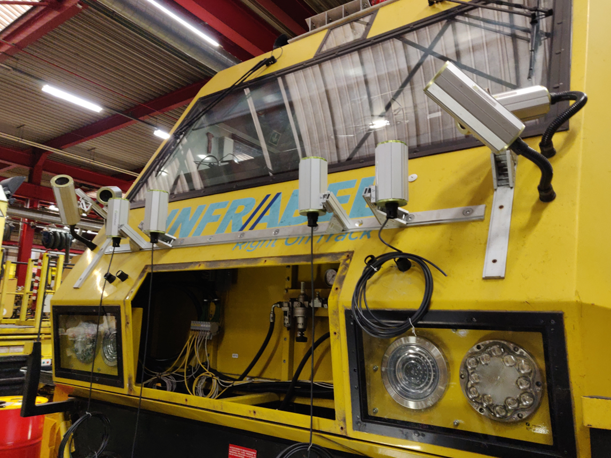
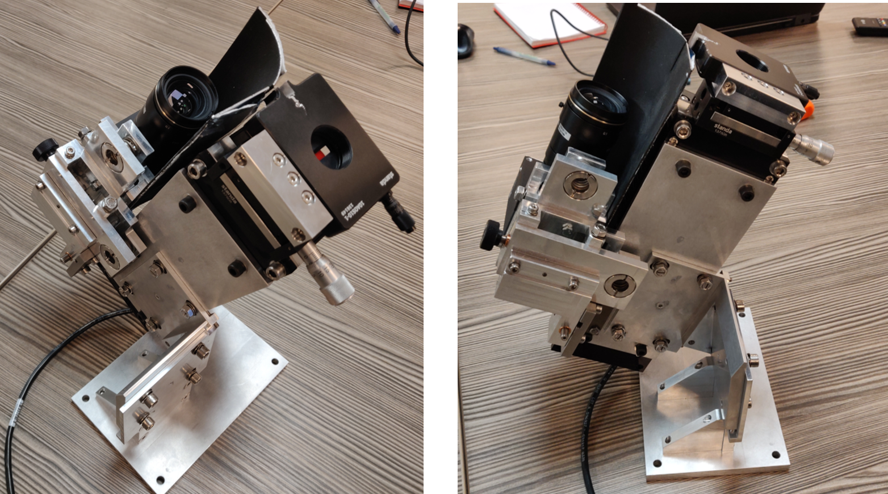
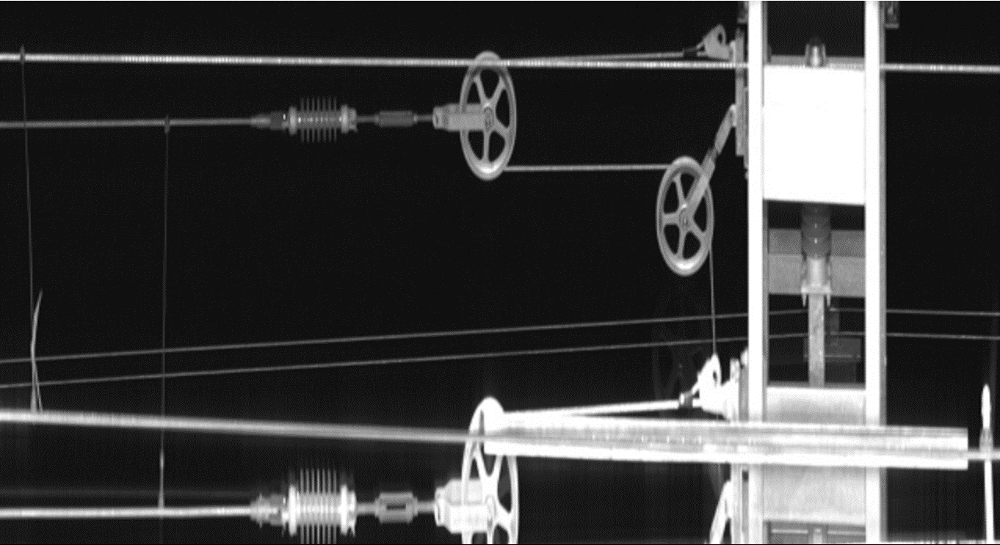
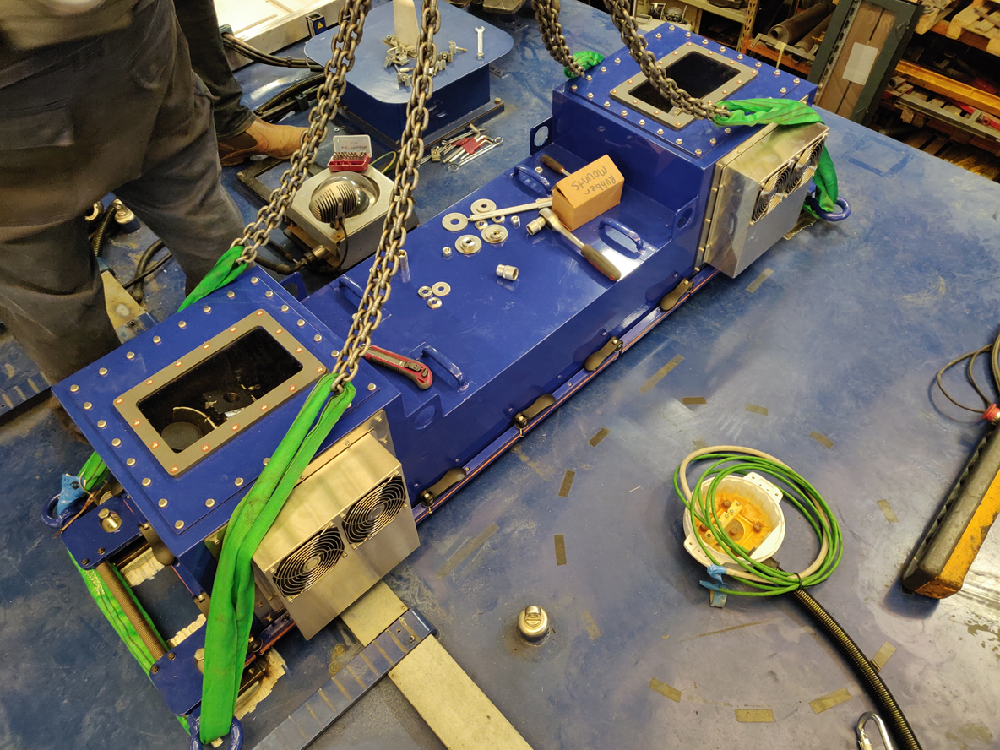
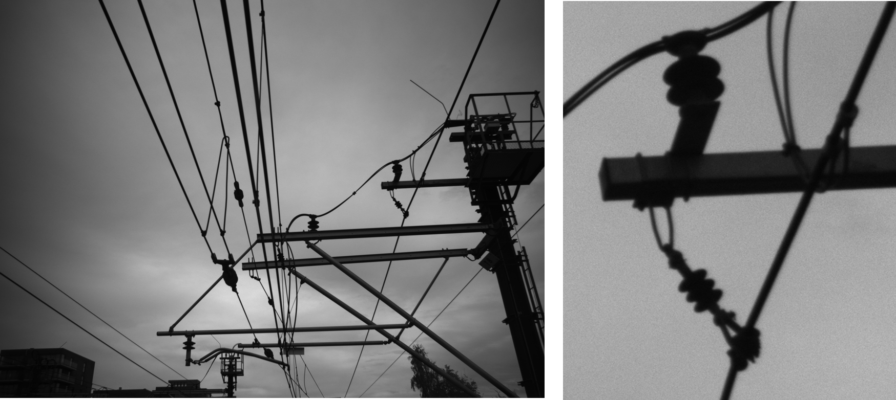
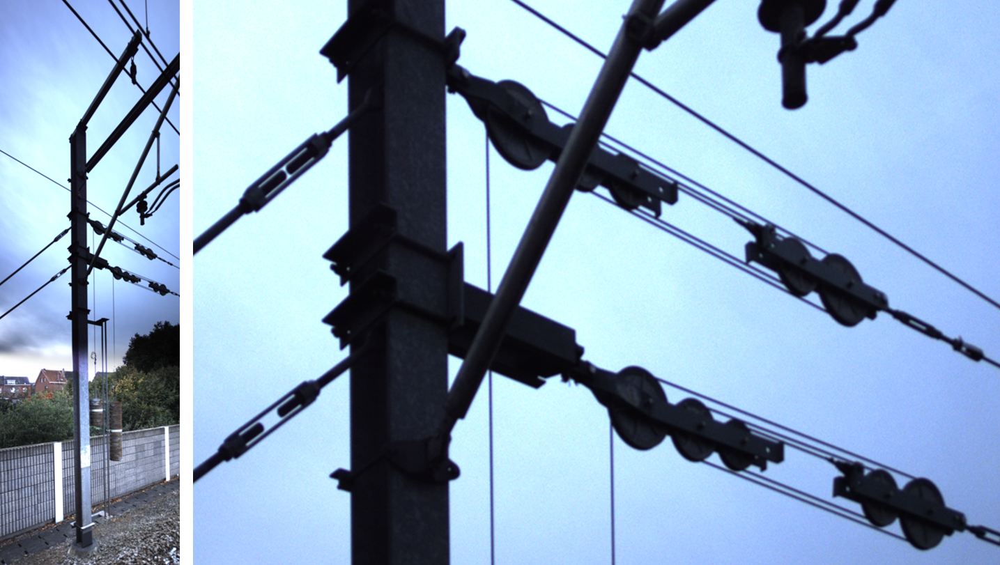

public:: true
type:: [[Project]]
description:: We installed over 16 camera's on a measurement train to inspect the overhead contact line system from multiple perspectives. The camera's are triggered based on distance travelled. The images are timestamped and the server time is synced with a Stratum 1 local NTP server. In post processing, the location of the images is calculated. The images are used for digital inspection of the system, both manual (using a webapp) and automatically (using AI).
has-category:: Measurement system
has-tagged-techniques:: #Camera, #Laser, #Railway, #NTP, #SSH, #Railway, #S3 
has-tagged-roles:: #[[Project lead]], #Technician
has-linked-projects:: #[[Image recognition AI]], #[[Location post processing system for railway vehicles]], #[[Stratum 1 NTP server]], #[[Webapp for digital inspection]], #[[Measurement train image post processing]] 
is-featured:: Yes
during-job:: #[[Job: engineer overhead contact lines]]

- 
- 
- 
- 
- 
- 