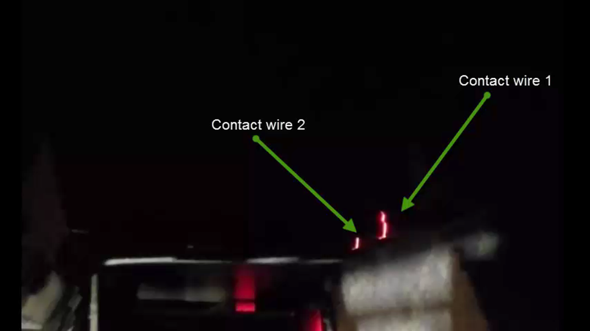
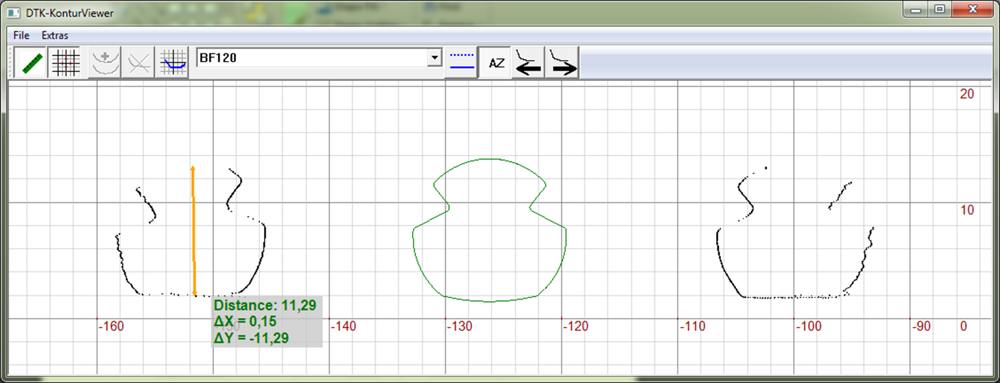
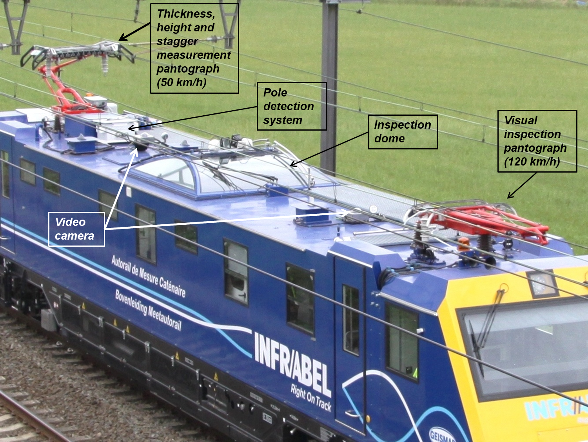
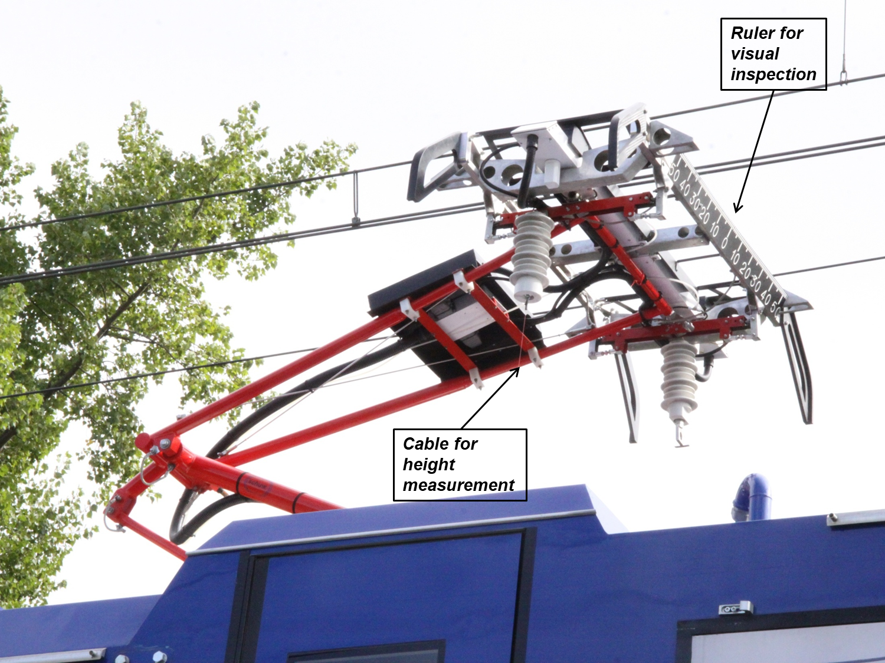

public:: true
type:: [[Project]]
description:: A hardware system using camera's and lasers mounted on a pantograph to measure the thickness of a wire. The results are very important to optimize maintenance and renewal and avoid catenary incidents.
has-category:: Measurement system
has-tagged-techniques:: #Camera, #Laser, #[[Laser triangulation]], #Railway 
has-tagged-roles:: #Developer, #[[Data architect]], #[[Business analyst]], #[[Project lead]] 
has-linked-projects:: #[[Linear measurement data viewer]], #[[Location measurement system for measurement train]], #[[Camera inspection system for OCL]] 
is-featured:: Yes
during-job:: #[[Job: engineer overhead contact lines]]

- 
- 
- 
- 