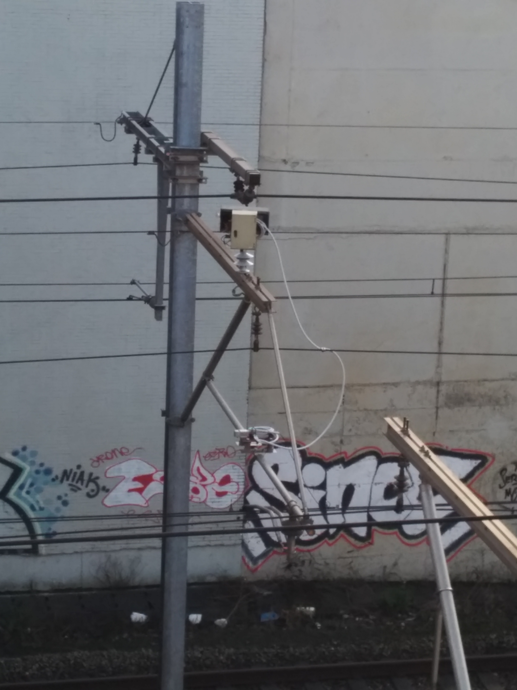
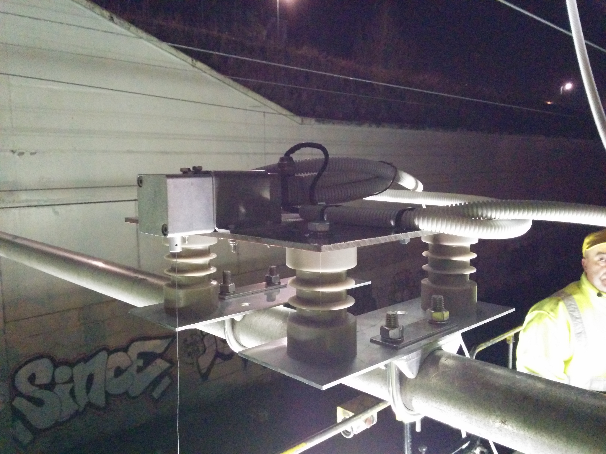

public:: true
type:: [[Project]]
description:: A solar/battery powered hardware system mounted in the catenary, measuring the vertical movement of the contact wire at the passage of a train.
has-category:: Measurement system
has-tagged-techniques:: #[[Raspberry Pi]], #Arduino, #C++
has-tagged-roles:: #Developper, #[[Business analyst]] 
has-linked-projects::
is-featured:: Yes
during-job:: #[[Job: engineer overhead contact lines]]

- This was a proof of concept. The system was completely designed and tested by myself, I even soldered the different components (RTC, RAM, GSM, PT100, ..) on the PCB.
- The system was in production during a few months and then removed for improvement into a production system.
- 
- 