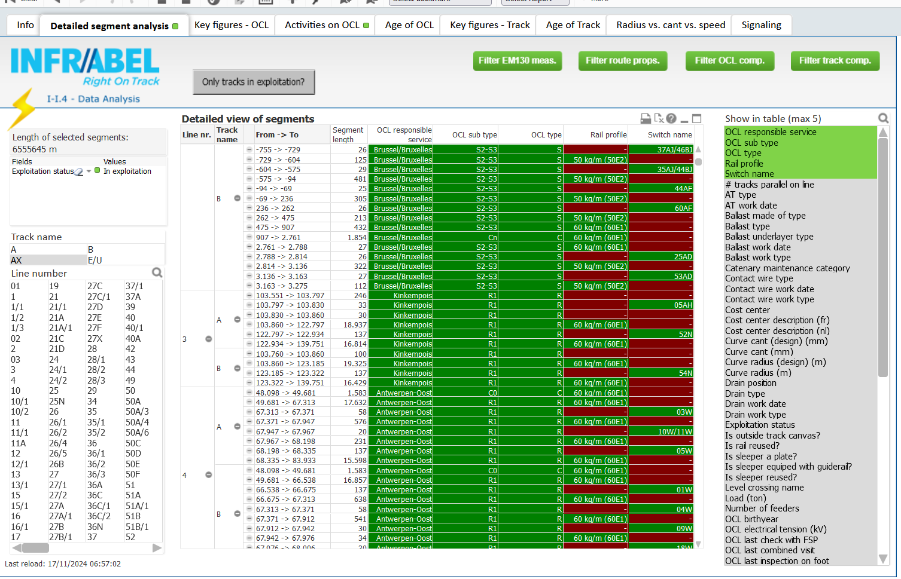

public:: true
type:: [[Project]]
description:: Linear assets and linear events typically have a start and an end position using a linear referencing system (kilometerpole position). For BI and operational systems, it is easier if these linear things are denormalised. A innovative model and process was thought out to calculate smallest linear segments with a unique set of properties (over 100 properties were thus defined).
has-category:: Data processing
has-tagged-techniques:: [[C#]], #Qlikview, #Postgresql, #Dbeaver, #Topology
has-tagged-roles:: #Developer, #[[Data architect]], #[[Business analyst]]
has-linked-projects:: #[[Linear measurement data viewer]], #[[OCL maintenance KPI's]] 
is-featured:: Yes
during-job:: #[[Job: engineer overhead contact lines]]

- 