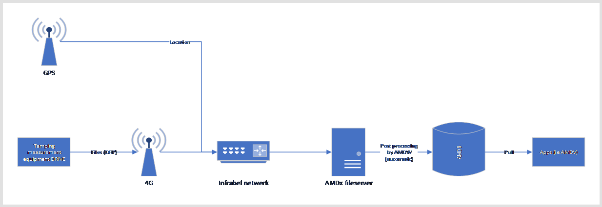

public:: true
type:: [[Project]]
description:: Older tamping machines use a relative system for track tamping. That means that the position of the track is corrected based on it's current position, contrary to a absolute system were the design position is respected. In order to make evaluate the effectiveness of tamping and ensure the end quality, the measurements that are done on the machine are forwarded and combined with design parameters and other measurements. For this, a state of the art GNSS system was installed, the measurement computers were connected to an Azure server over SSH and data transfer is automated.
has-category:: Measurement system
has-tagged-techniques:: #SSH, #[[Reverse proxy]], #GNSS, #Azure 
has-tagged-roles:: #Developer, #Technician, #[[Project lead]] 
has-linked-projects:: #[[Linear measurement data viewer]] 
is-featured:: Yes
during-job:: #[[Job: Project lead SMILE]]

- 