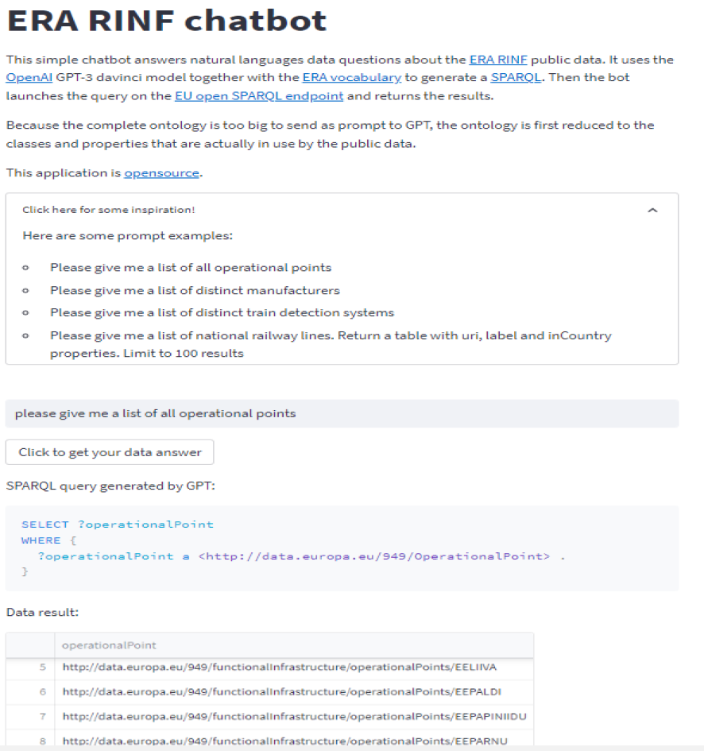

public:: true
type:: [[Project]]
description:: A proof of concept to show how RDF data together with an ontology can be used together with a LLM such as ChatGPT. The project result is a public web application where the user can ask questions in natural language and get a data result as output.
has-category:: Semantic technologies
has-tagged-techniques:: #[[ERA ontology]], #RDF, #OWL, #[[LLM & ChatGPT]], #Git, #[[Gitlab CI CD]], #Azure, #Python, #Streamlit, #Docker 
has-tagged-roles:: #Ontologist, #Developer, #[[DevOps engineer]] 
has-linked-projects:: #[[Enterprise data model]] 
is-featured:: Yes
during-job:: #[[Job: Teamlead data centricity]]
external-link:: https://gitlab.com/mathias.vanden.auweele/era-rinf-chatbot

- Link to demo environment available on request.
- 