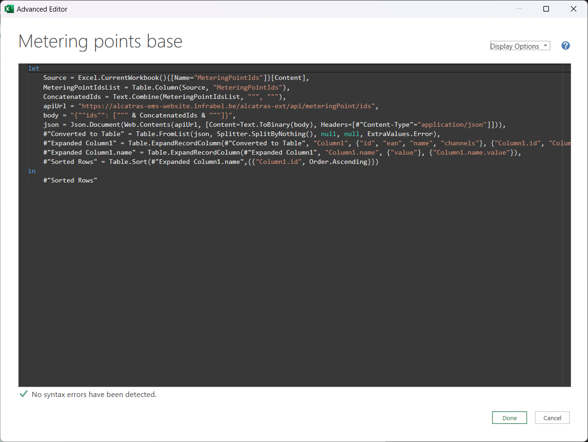
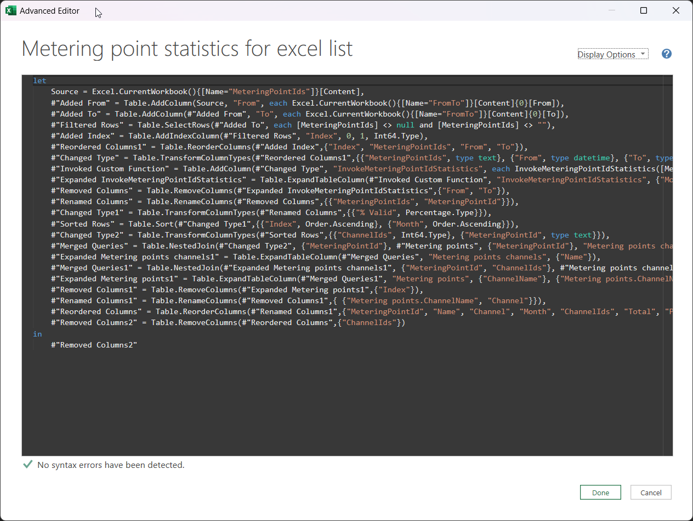
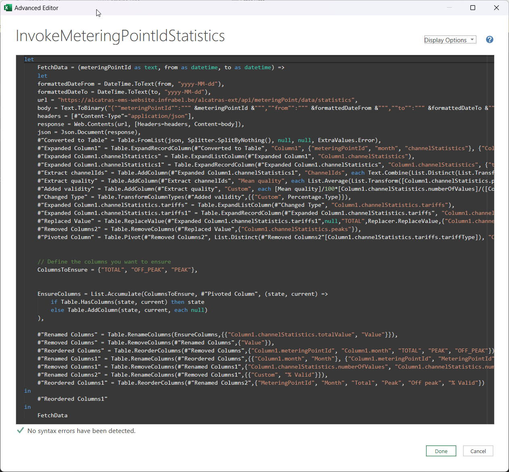

public:: true
type:: [[Project]]
description:: Energy settlement (responsible for a large part of the operational turnover of the company) is still done mainly using Excel. Several interfaces to existing JSON API services were added to the Excel file to add a higher level of automation to the system. 
has-category:: Data processing
has-tagged-techniques:: #[[Power Query]], #Excel, #[[JSON API]] 
has-tagged-roles:: #Developer, #[[Business analyst]], #[[Data architect]] 
has-linked-projects::
is-featured:: Yes
during-job:: #[[Job: Teamlead data centricity]]

- 
- 
- 