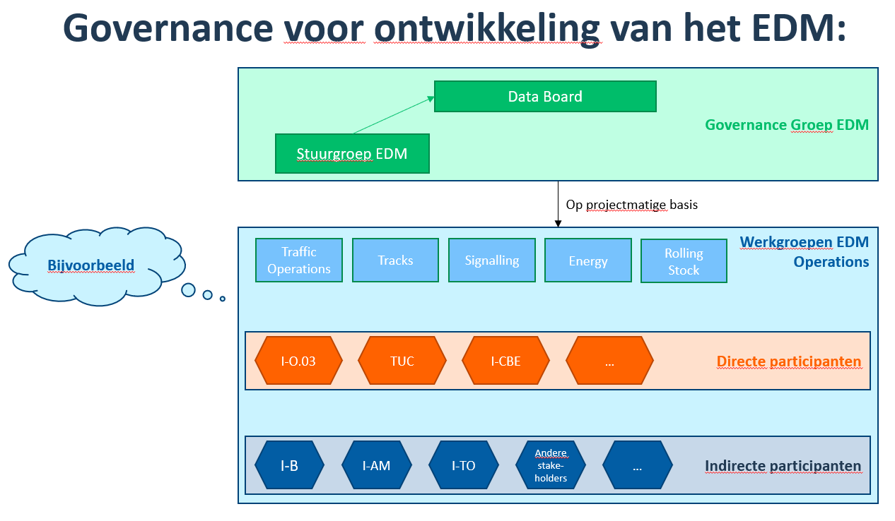
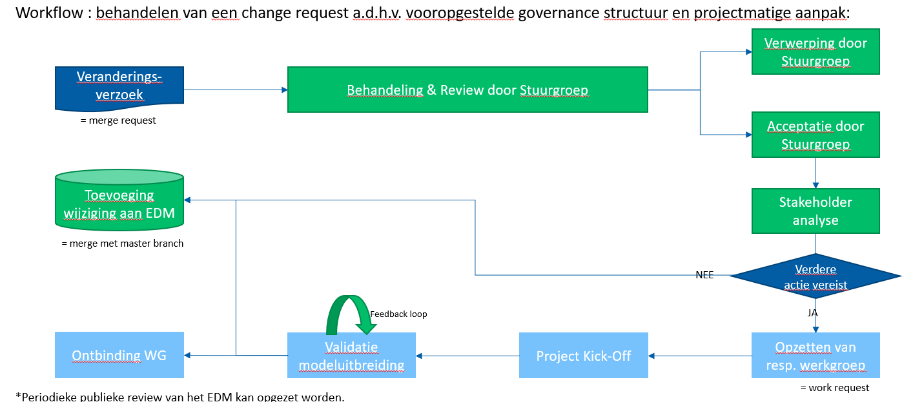
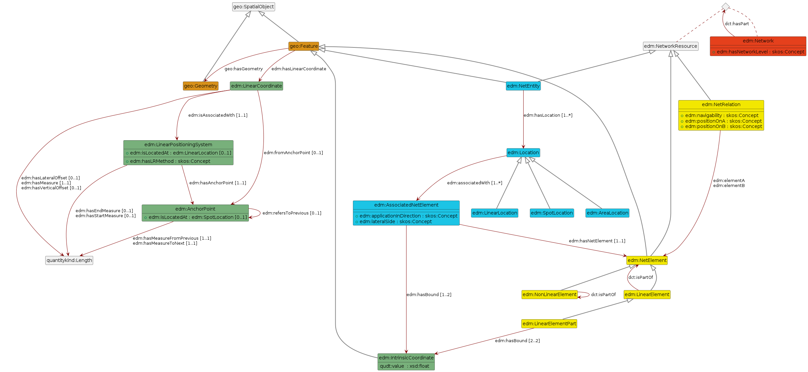
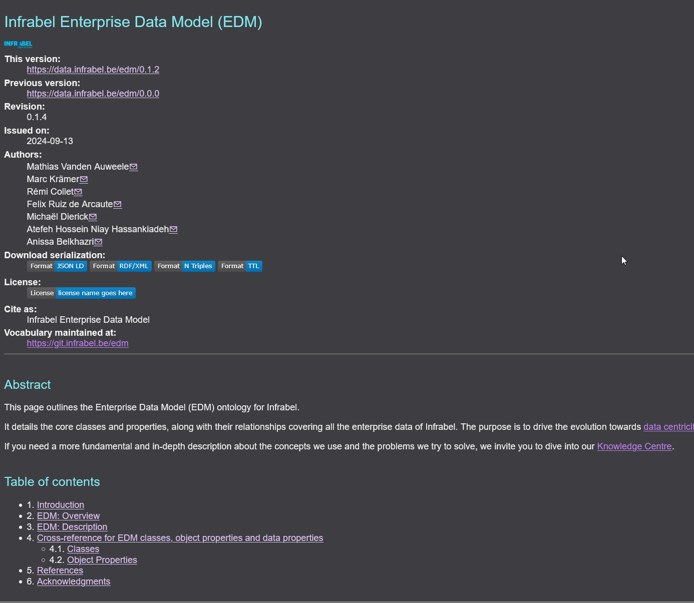

public:: true
type:: [[Project]]
description:: A very important element in an enterprise to avoid siloed data, is to have an enterprise data model by which the data (and applications..) are modelled. This ensures data interoperability from the start of the application. When dealing with legacy systems, starting an enterprise data model is not that easy. The goal of this project is setting up a team of experts that know the domain and are able to model the enterprise. In order to make the model as extensible as possible, semantic technologies were chosen. The model is published in different forms, among which is a Widoco internet site. 
has-category:: Semantic
has-tagged-techniques:: #Gist, #[[ERA ontology]], #RTM, #RailML, #Git, #[[Gitlab CI CD]], #Widoco, #OWL, #SKOS, #SHACL, #[[SHACL Play]], #Protege 
has-tagged-roles:: #Teamlead, #Teacher, #Ontologist, #Developer, #[[DevOps engineer]] 
has-linked-projects:: #[[Data centric strategy]], #[[Enterprise data governance model]] 
is-featured:: Yes
during-job:: #[[Job: Teamlead data centricity]]

- 
- 
- 
- 