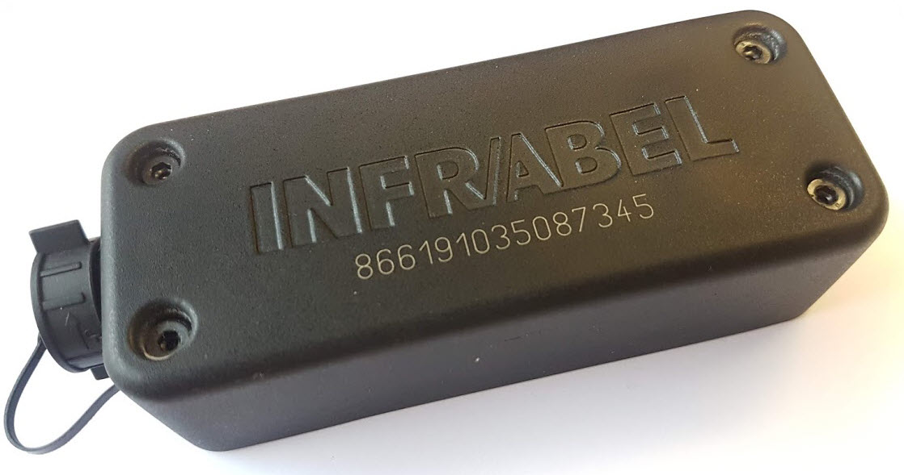
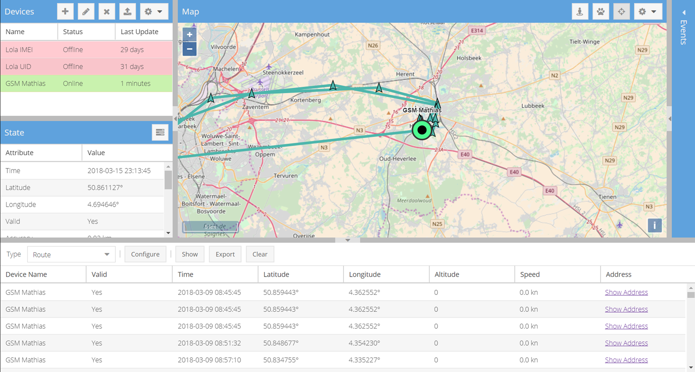
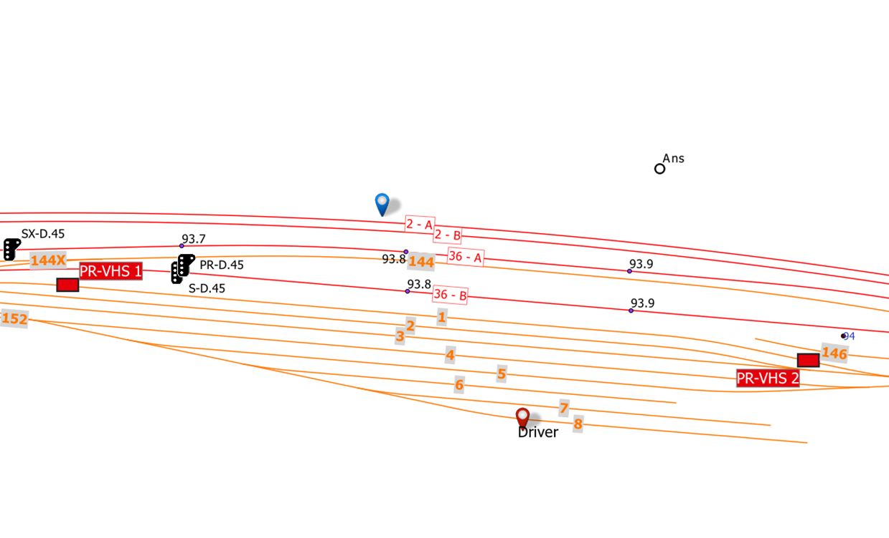

public:: true
type:: [[Project]]
description:: In order to reduce the number of "signals passed at danger", a project was launched to track in real time the location of safety equipment. A custom GPS tracker was designed and interfaced with the internal network over LTE.
has-category:: Measurement system
has-tagged-techniques:: #GNSS, #Git, #[[Gitlab CI CD]], #[[C# .NET]], #[[JSON API]], #Traccar, #Firewall, #Binary 
has-tagged-roles:: #Developer, #[[Project lead]], #[[Business analyst]] 
has-linked-projects:: #[[Train alert system]] 
is-featured:: Yes
during-job:: #[[Job: Project lead SMILE 2.0]]

- 
- 
- 