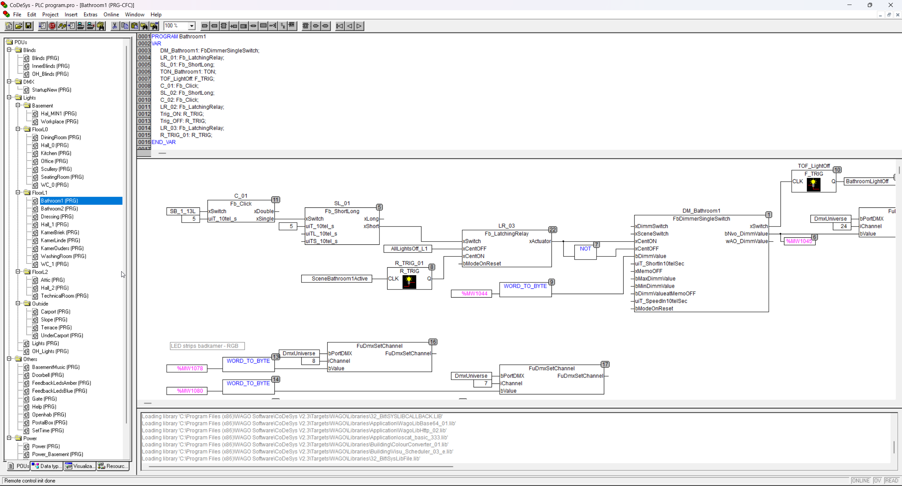
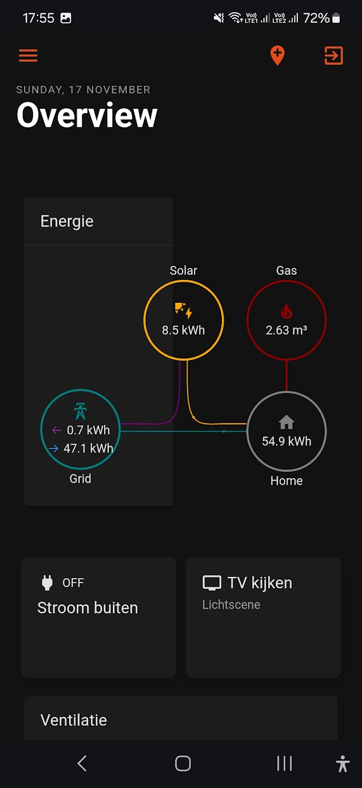
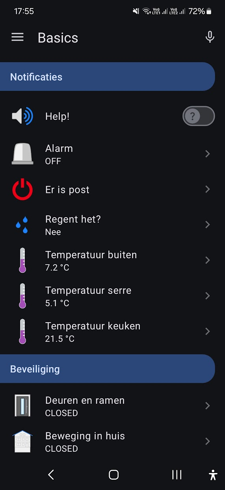
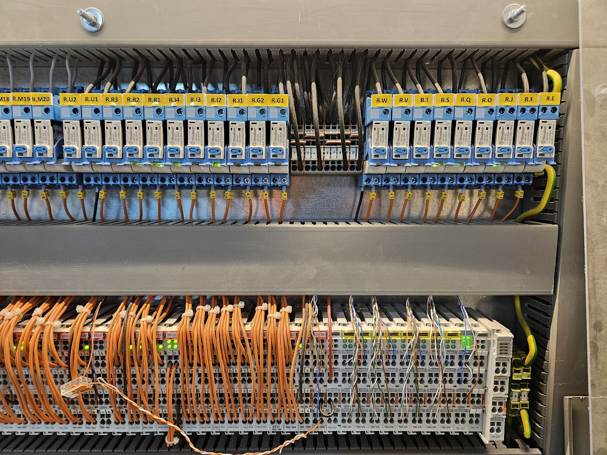
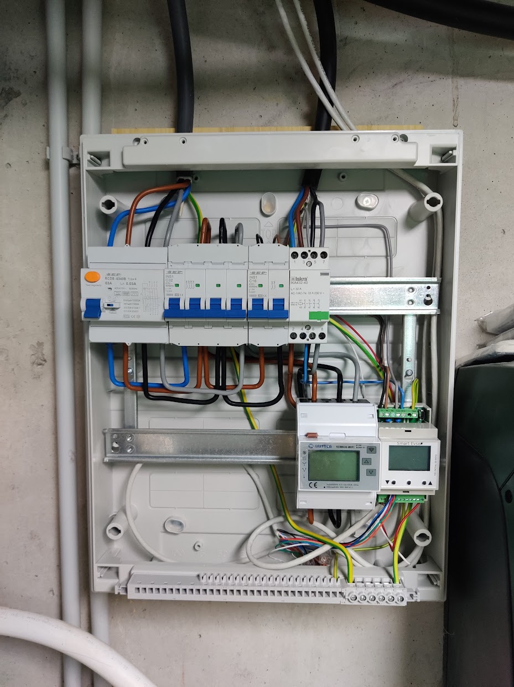
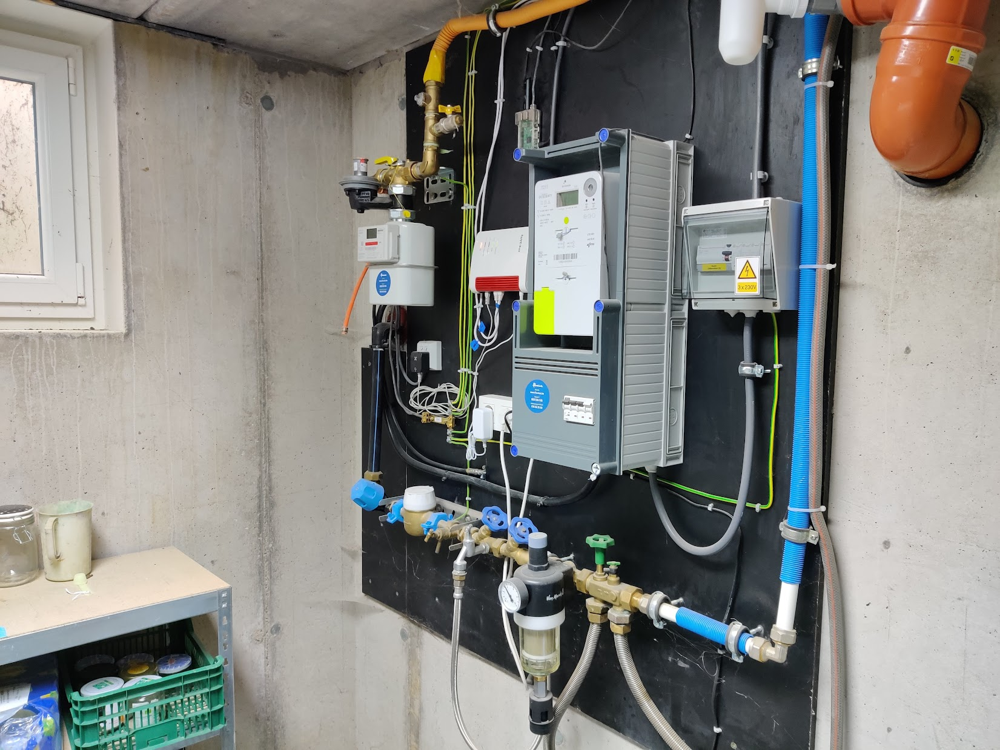
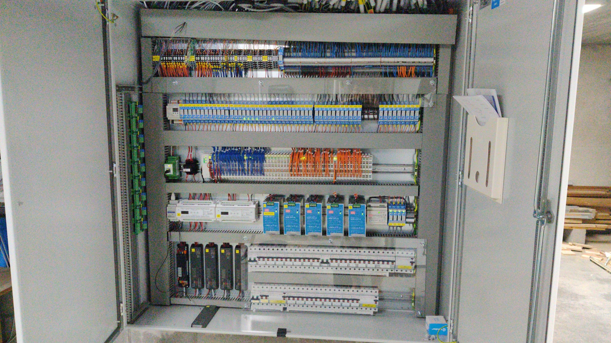
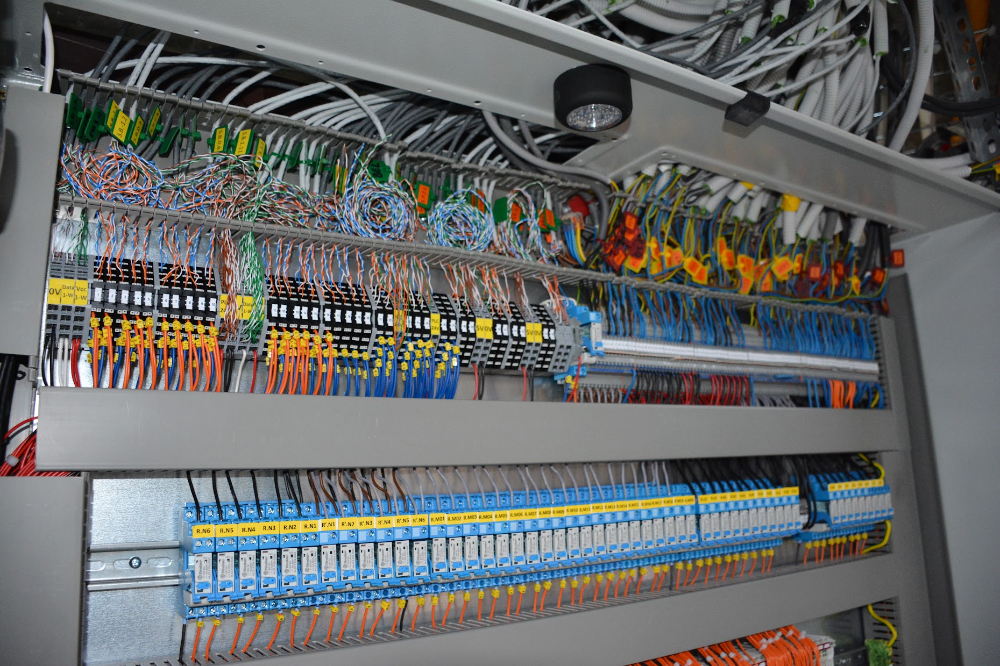

public:: true
type:: [[Project]]
description:: Very advanced home automation. The basic logic level is run by a Wago PLC that is interfaced with Openhab for higher level logic and user interfacing. A lot of sensors are custom made (PIR motion sensors, reed sensors, water level sensor, current sensing, ...) and interfaced using ESP32 boards like NodeMCU. Several software programs are custom built to make custom interfaces with existing product interfaces (like pushing telnet data to mqtt)
has-category:: Data platform
has-tagged-techniques:: #OpenHAB, #Git, #MQTT, #ESP32, #NodeMCU, #PLC, #[[Gitlab CI CD]], Docker, #[[C#]], #Caddy, #Django, #DSMR, #Firewall, #[[Reverse proxy]], #Git, #Grafana, #Logseq, #Loki, #Prometheus, #NFC, #Postgresql, #Dbeaver, #Python, #SSH, #Telnet, #Arduino, #Cloudflare, #[[Raspberry Pi]], #VPN 
has-tagged-roles:: #Developer, #[[Data architect]], #[[Product owner]], #[[Business analyst]], #[[DevOps engineer]], #[[Project lead]], #Technician
has-linked-projects::
is-featured:: No
during-job::

- {:height 405, :width 736}
- 
- 
- 
- 
	- Charging station
- 
- 
- 