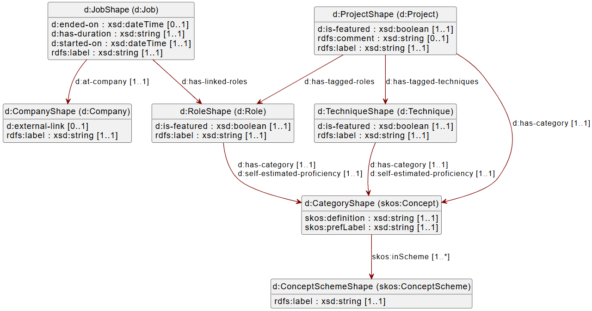

- #+BEGIN_NOTE
  Welcome to my expertise graph.
  #+END_NOTE
- This website is a knowledge graph. Is this your first graph experience? Don't worry, it's very similar to any other website. The data is just linked, so be sure to click through and follow the data.
	- Example: a project's page will describe the project but also the role I had and the techniques that were used. So you can click on the role link and see other projects in which I had the same role.
- The goal of this graph is to prove my expertise according to different axes in an interactive way. Something you would also find in a resume. The added value can be found in the fact that here I can go into details with for example screenshots and testimonials.
- Some interesting starting pages
	- #[[Featured projects]]
	- #[[Featured roles]]
	- #[[Featured talks]]
	- #[[Featured techniques & tools]]
	- #[[My resume]]
- #+BEGIN_NOTE
  Be sure to check the [graph view](https://expertise.matdata.eu/#/graph) for inspiration!
  #+END_NOTE
- The structured data of this graph is available in RDF:
	- [As a file to be downloaded](https://expertise.matdata.eu/static/matdata-expertise.ttl)
	- [Queryable using SPARQL](https://yasgui.matdata.eu/#query=PREFIX%20rdf%3A%20%3Chttp%3A%2F%2Fwww.w3.org%2F1999%2F02%2F22-rdf-syntax-ns%23%3E%0APREFIX%20rdfs%3A%20%3Chttp%3A%2F%2Fwww.w3.org%2F2000%2F01%2Frdf-schema%23%3E%0APREFIX%20mde%3A%20%3Chttps%3A%2F%2Fexpertise.matdata.eu%2F%23%2Fpage%2F%3E%0A%0ASELECT%20%3Fpage%20%3FprojectTitle%20%3FprojectDescription%0AWHERE%20%7B%0A%20%20%3Fpage%20a%20mde%3AProject%20%3B%0A%20%20%20%20%20%20%20%20rdfs%3Alabel%20%3FprojectTitle%20%3B%0A%20%20%20%20%20%20%20%20mde%3Ais-featured%20%3Fis_featured%20%3B%0A%20%20%20%20%20%20%20%20rdfs%3Acomment%20%3FprojectDescription%20.%0A%20%20FILTER%20(%3Fis_featured%20%3D%20true)%0A%7D&endpoint=https%3A%2F%2Fjena.matdata.eu%2Fexpertise%2Fquery&requestMethod=POST&tabTitle=Query%205&headers=%7B%7D&contentTypeConstruct=text%2Fturtle%2C*%2F*%3Bq%3D0.9&contentTypeSelect=application%2Fsparql-results%2Bjson%2C*%2F*%3Bq%3D0.9&outputFormat=Table)
		- SPARQL endpoint: https://jena.matdata.eu/expertise/query
	- The [SHACL shapes](https://expertise.matdata.eu/static/matdata-expertise-shacl.ttl) used to validate this graph complies with the UML diagram below:
		- 