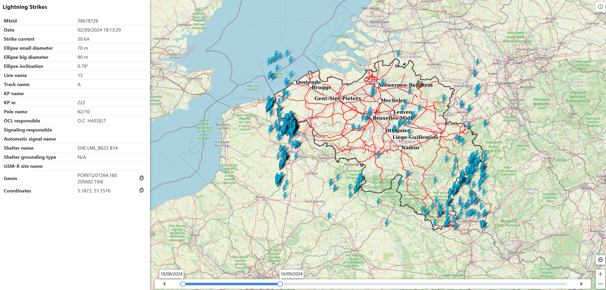
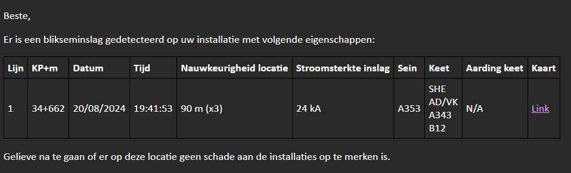

public:: true
type:: [[Project]]
description:: Lightning strikes on railway infrastructure can cause serious damage and is not always detected. There exist commercially available measurement systems that interface their data of the lightning strike location and strength. We interfaced with these datasources and mapped the location (with some business rules) on the rail network. An email system was put in place to notify the installation responsible person. A GIS webapp and dashboard were also developed.
has-category:: Data processing
has-tagged-techniques:: [[C# .NET]], #Git, #[[Gitlab CI CD]], #QGIS, #Angular, #Leaflet, #Qlikview, #PostGIS, #Postgresql, #Dbeaver, #MSSQL, #Kerberos, #Nginx, #Docker, #Openshift
has-tagged-roles:: #Developer, #[[Project lead]], #[[Data architect]]
has-linked-projects:: #[[Linear measurement data viewer]]
is-featured:: Yes
during-job:: #[[Job: engineer overhead contact lines]]

- 
- 