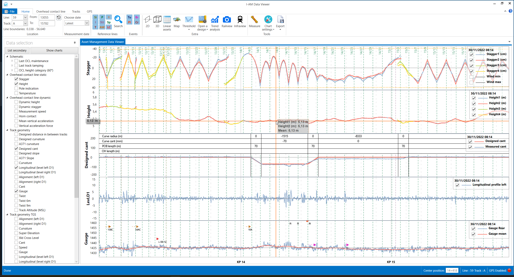
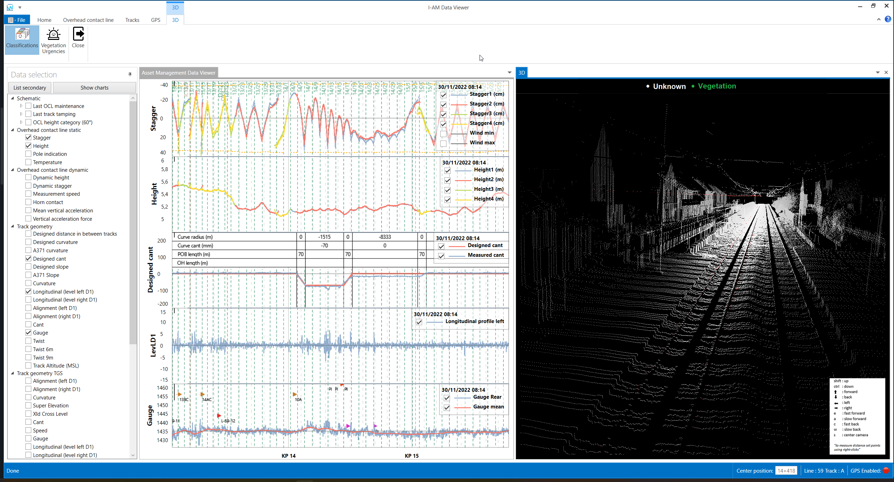
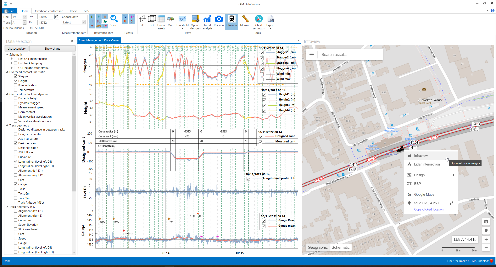
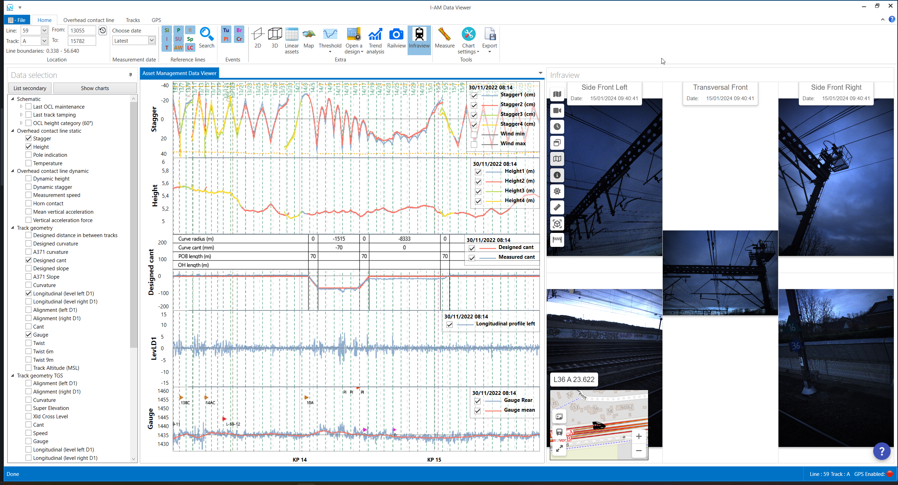

public:: true
type:: [[Project]]
description:: Linear measurements used to be distribute on paper or sometimes pdf. Obviously, this does not allow for normal data analysis, let alone be a driver for predictive maintenance. For this project, a data platform was set up with an automatic data transfer from measurement system to storage, automatic loading of the measurement onto the data platform and alert creation according to business rules. Furthermore an analysis desktop tool was developed that allows to visualise the measurement on an interactive chart. Other features were also developed, such as an image viewer, lidar viewer, trend analysis, inventory viewer and management, event viewer, GIS viewer, GPS tracking, export, ...
has-category:: Desktop app
has-tagged-techniques:: [[C# .NET]], #Serilog, #Git, #[[Gitlab CI CD]], #ClickOnce, #Postgresql, #Dbeaver, #PostGIS, #Scichart, #Topology, #Qlikview, #Camera, #Lidar, #WMS, #Leaflet, #GPSD
has-tagged-roles:: #[[Project lead]], #[[Business analyst]], #[[Data architect]], #[[Data analyst]], #Developer, #[[DevOps engineer]]
has-linked-projects:: #[[Camera inspection system for OCL]], #[[Location measurement system for measurement train]], #[[Mobile app for geolocated technical assistance]], #[[Pole inventory management system]], #[[Pantograph shock detection system]], #[[Contact wire thickness measurement system]], #RCM-DX, #[[Webapp for digital inspection]], #[[Generic business rules validation system on linear measurements]]
is-featured:: Yes
during-job:: #[[Job: engineer overhead contact lines]]

- 
- 
- 
- 
-
