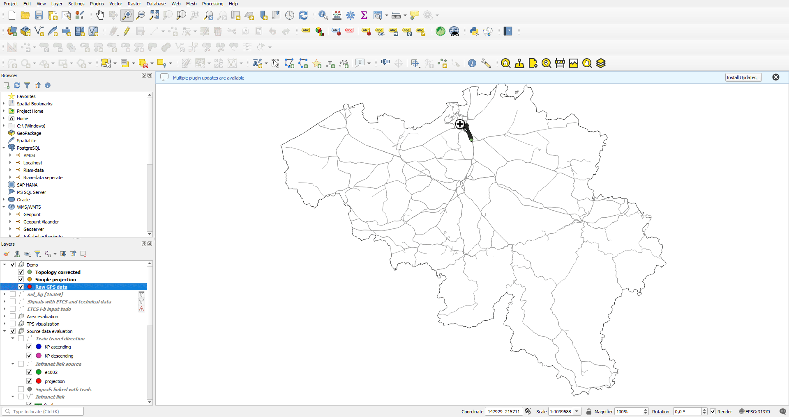
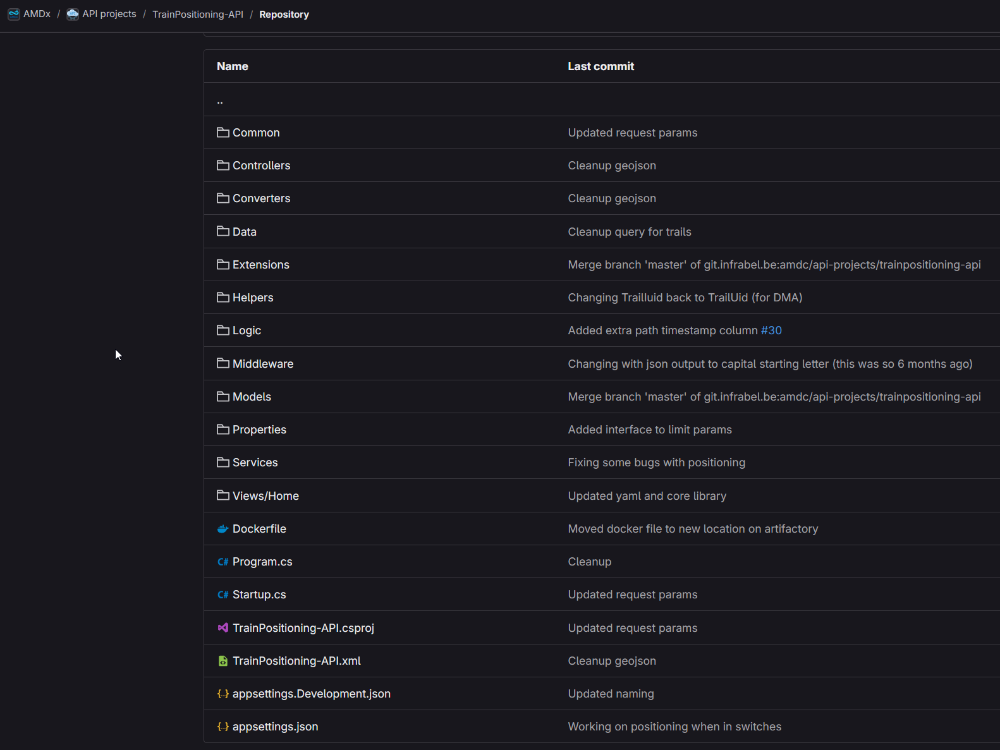

public:: true
type:: [[Project]]
description:: Train vehicle locations arrives as GNSS positions. Depending on the quality of the hardware, a reliable and accurate position is not always guaranteed. The post processing system will handle a location collection from a train path and use all available information sources, such as signaling train detection information, in order to improve the quality of the location. This is very important for other infrastructure measurements.
has-category:: Data processing
has-tagged-techniques:: #GNSS, #[[C#]], #Git, #[[Gitlab CI CD]], #IMU, #Odometry, #Topology, #QGIS, #PostGIS, #Postgresql, #Dbeaver, #PgRouting, #S3, #Openshift, #Serilog, #Quartz, #RTM
has-tagged-roles:: #Developer, #[[Business analyst]], #[[Data architect]], #[[Project lead]]
has-linked-projects:: #Openrail, #[[Camera inspection system for OCL]], #[[Location measurement system for measurement train]], #[[Contact wire thickness measurement system]]
is-featured:: Yes
during-job:: #[[Job: Project lead digitalisation linear assets]]

- 
- 
- Soon to be open sourced