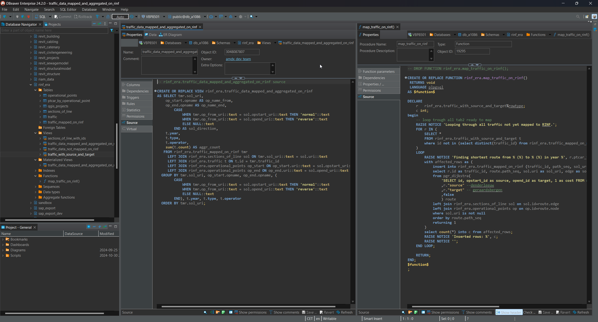

public:: true
type:: [[Project]]
description:: The EU requests publishing data based on the RINF data model. Our train statistics data model is not using the RINF model as a basis. A translation system was set up to convert from one model into the other allowing to comply with EU requirements.
has-category:: Data processing
has-tagged-techniques:: #SPARQL, #Postgresql, #Dbeaver, #PgRouting, #Git, #[[ERA ontology]], #RTM, #QGIS, #Excel, #Plpgsql
has-tagged-roles:: #Developer, #[[Data analyst]], #[[Data architect]]
has-linked-projects:: #[[ERA RINF Chatbot]]
is-featured:: Yes
during-job:: #[[Job: Teamlead data centricity]]

- 
-