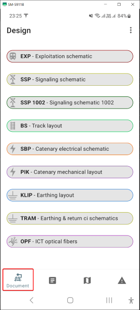
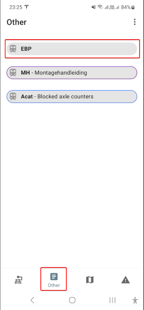
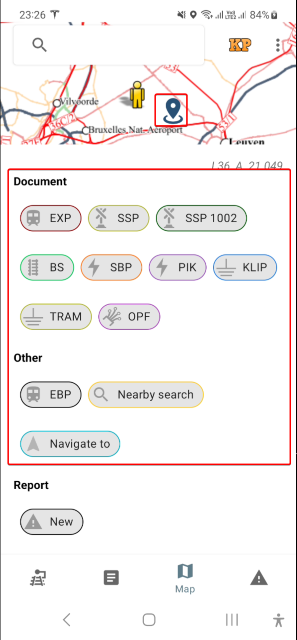
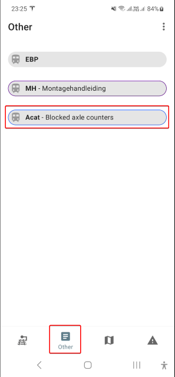
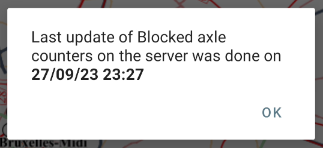
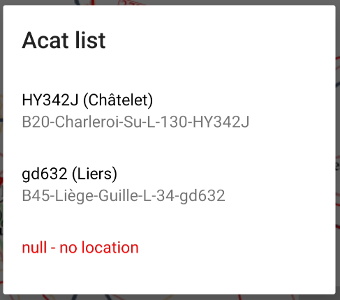
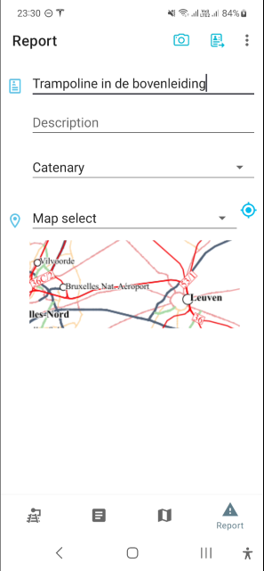
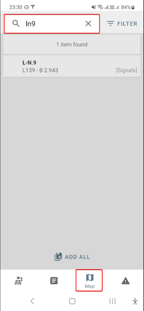
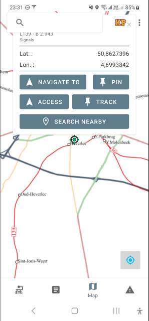
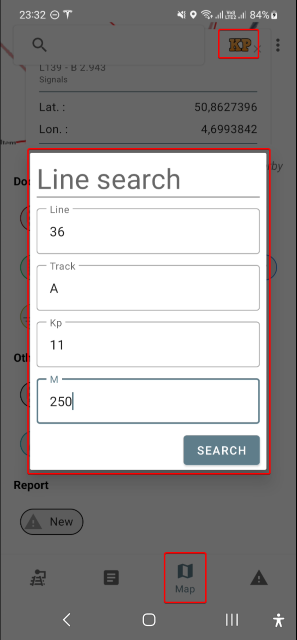

public:: true
type:: [[Project]]
description:: This was the first mobile application of the enterprise. It's a GIS application, working very similar to a Map application. The user can interact with the map, search for assets, get directions, report incidents, ... Very important features of the app were the ability to visualise defect axle counters. This mostly happened during works and with the mobile app, the work teams have the ability to repair the issue before the track enters back into service (which would cause a significant amount of delays). Also requesting the technical designs or the traffic management system viewer based on your location is possible.
has-category:: Mobile app
has-tagged-techniques:: #Android, #iOS, #VueJs, #Git, #[[Gitlab CI CD]], #Fastlane, #GNSS, #[[JSON API]], #[[C# .NET]], #Azure, #SSH 
has-tagged-roles:: #Developer, #[[Project lead]], #[[Data architect]], #Teamlead, #[[Business analyst]] 
has-linked-projects:: #[[Linear measurement data viewer]] 
is-featured:: Yes
during-job:: #[[Job: engineer overhead contact lines]]
external-link:: https://apps.apple.com/be/app/amdm/id1553037373, https://play.google.com/store/apps/details?id=be.infrabel.amdm&hl=en, https://amdm-web.infrabel.be/

- Main features & screenshots:
	- Open a design or the EBP screen applicable for your current location
		- 
		- 
	- Open a design or EBP screen applicable for a location on the map
		- 
	- Visualize the blocked axle counters (ACAT)
		- 
		- Message appears with information about data freshness
			- 
		- It's possible that for some ACAT, the location is not known. It is not possible to display these on the map, so viewing a LIST is possible
			- 
			- 
	- Create a incident report, with photo, location and description (integrated with Workflow)
		- 
	- Search assets and KP location
		- 
		- 
	- Display your current KP location or that selected on the map
	- Navigate to asset or use compass
		- 