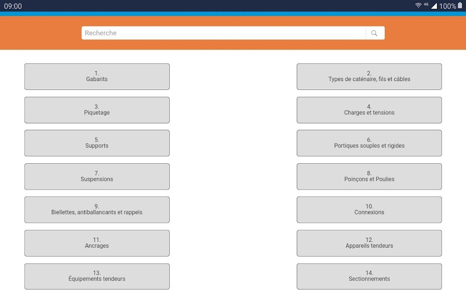

id:: 67326741-8497-49a1-9305-ee8bc1ae0408
public:: true
type:: [[Project]]
description:: A mobile app for catenary technicians for documentation lookup that is accessible offline and synced when online. The app uses Git to accomplish the syncing.
has-category:: Mobile app
has-tagged-techniques:: #[[C#]], #Android, #iOS, #Git, #Fastlane
has-tagged-roles:: #[[Business analyst]], #[[Data architect]], #[[DevOps engineer]]
has-linked-projects:: #[[Mobile time registration system with NFC badges]], #[[Mobile app for geolocated technical assistance]]
is-featured:: Yes
during-job:: #[[Job: engineer overhead contact lines]]
external-link:: https://apps.apple.com/be/app/infradoc/id1592342814, https://play.google.com/store/apps/details?id=be.infrabel.infradoc

- DevOps: using #Fastlane to control the deployment on Google Play store and iOS app store through the #[[Gitlab CI CD]]. All store information is managed in git.
- The innovative approach in this application was the use of #Git to sync online documentation locally whenever the device is used while online.
- 