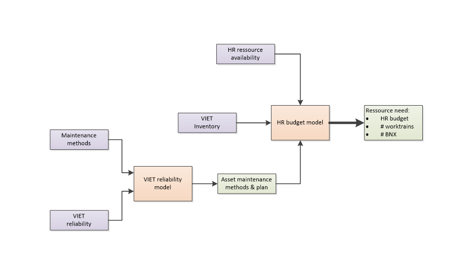

public:: true
type:: [[Project]]
description:: The enterprise is divided into about 15 workcenters. Each workcenter is assigned a certain resource amount, expressed in full time equivalents and number of worktrains. Each workcenter has also a certain amount of workload, expressed in number of assets and their maintenance charge. The project had as goal to create an objective and as realistic as possible model to calculate the absolute resource need for each workcenter. Simulations should also be possible: what if workcenters would merge, what if maintenance load increased, what if new assets were assigned, ...
has-category:: Strategy
has-tagged-techniques:: #Excel, #VBA, #SQL, #Postgresql, #Dbeaver, #Oracle
has-tagged-roles:: #[[Project lead]], #[[Business analyst]], #Developer, #[[Data analyst]], #[[Data architect]]
has-linked-projects:: #[[Product owner: work management system OCL]], #[[OCL maintenance KPI's]]
is-featured:: Yes
during-job:: #[[Job: engineer overhead contact lines]]

- #+BEGIN_IMPORTANT
  Innovative approach: calculation based on the number of maintenance teams required, and determining the most lean team.
  #+END_IMPORTANT
	- Contrary to direct FTE calculation, this approach results in a more logical number result and the ability to determine out resources as well. Since the regular work schedule will let 1 team in 3 be active, the number of worktrains can be set to 1 out of every 3 teams per geographic area.
- 