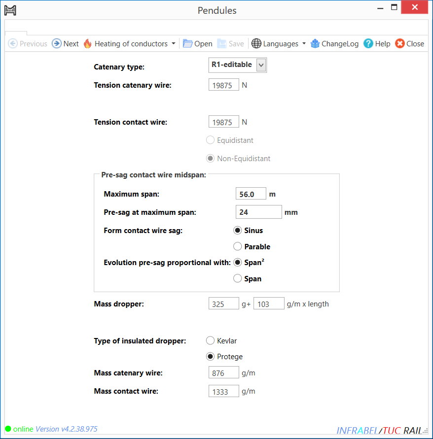
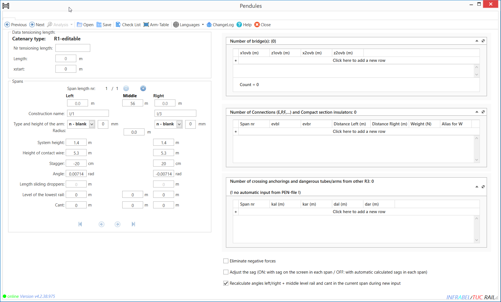
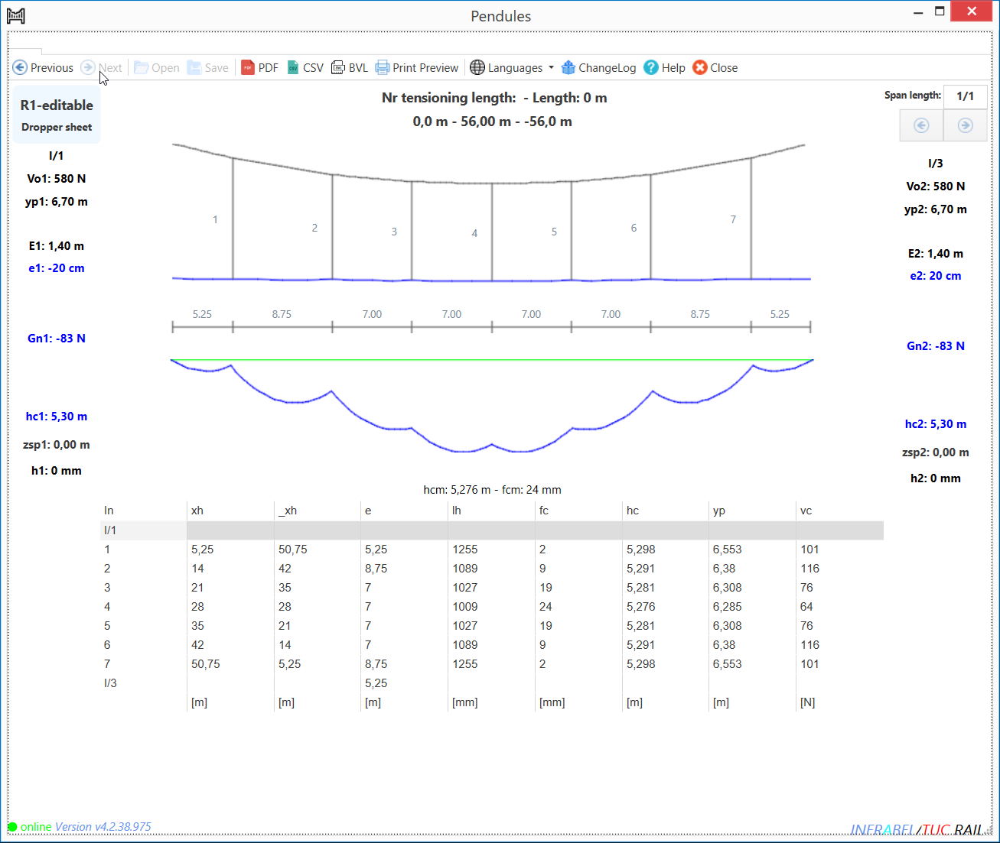

public:: true
type:: [[Project]]
description:: Pendules are the vertical droppers that suspend the contact wire to the carrier wire of the overhead contact line system. The application calculates the required dropper length, based on span width, system height and lots of other system and engineering project parameters. Initially the scope was to convert a legacy VB application with a very bad architecture into a modern C# .NET application with a good architecture. The logic needed to be separated from the visualisation so that the logic could also be implemented into other business applications. After the initial scope was completed, the business rules were revised and are still being revised as business learn more about the system.
has-category:: Desktop app
has-tagged-techniques:: [[C# .NET]], #ClickOnce, #Git, #[[Gitlab CI CD]], #Railway, #Postgresql, #Dbeaver, #Scichart
has-tagged-roles:: #[[Business analyst]], #[[Project lead]]
has-linked-projects:: #[[Linear measurement data viewer]]
is-featured:: No
during-job:: #[[Job: engineer overhead contact lines]]

- 
- 
- 