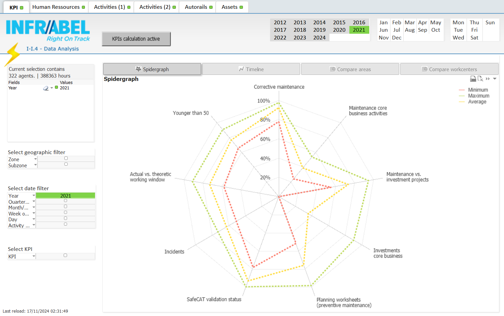

public:: true
type:: [[Project]]
description:: The goal of the project was to define a balanced set of work related KPI's to evaluate workcenters. The balance was in predictive KPI's and historical KPI's. The report was also augmented with indicators that could explain a less favorable KPI (for example, the experience of the workforce or the availability of resources). The reporting was automated and centrally available.
has-category:: Business process
has-tagged-techniques:: #Qlikview, #Postgresql, #Dbeaver, #Oracle, #SQL
has-tagged-roles:: #Developer, #[[Business analyst]]
has-linked-projects::
is-featured:: No
during-job:: #[[Job: engineer overhead contact lines]]

- 