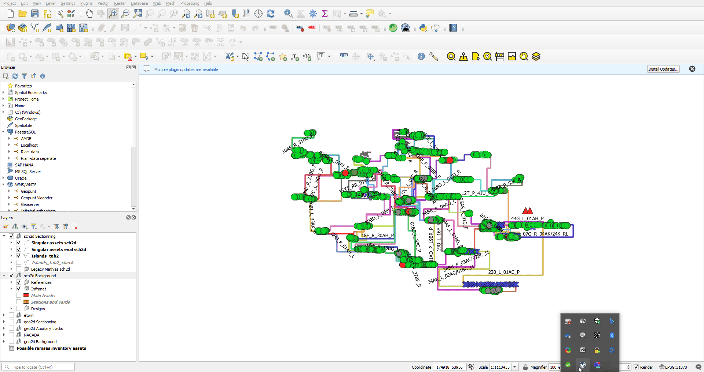
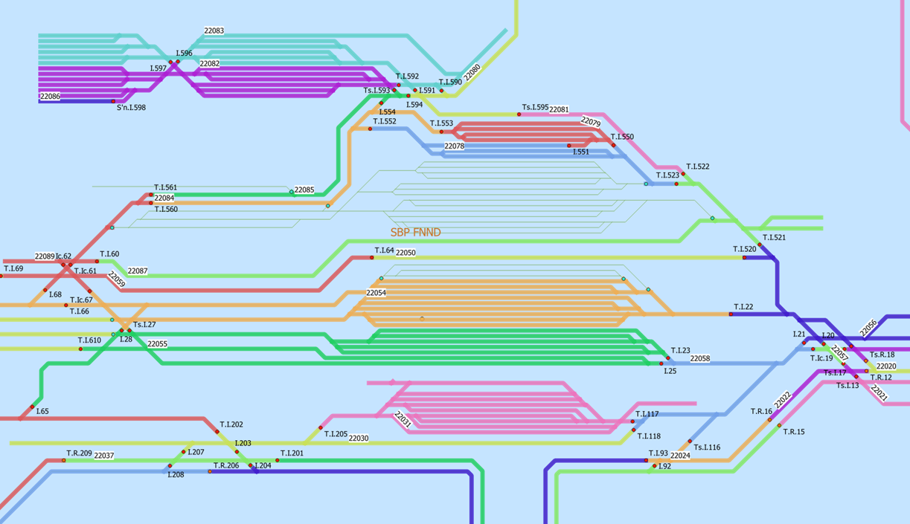
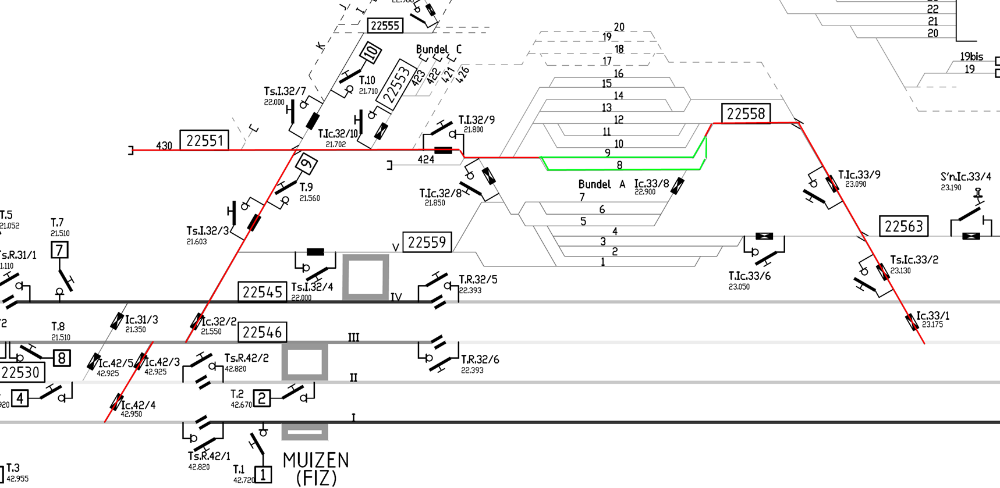

public:: true
type:: [[Project]]
description:: A frontend GIS (graphical) management application running in QGIS to build and update the sectioning database of the overhead contact line. The base layer is the track topology on which a layer of sectioning elements and cables are attached. A backend program creates a sectioning topology from these singular and linear elements that is linked to the track topology. The resulting data-centric inventory is then used for calculating the electrified length of the network, for safety sheets or even for validating request for putting out of service.
has-category:: Data management app
has-tagged-techniques:: #QGIS, #Topology, #RTM, #Postgresql, #Dbeaver, #PostGIS, #Git, #[[Plpgsql]], #PgRouting, #Railway, #Quartz, #[[Data centricity]]
has-tagged-roles:: #Developer, #[[Business analyst]], #[[Data architect]]
has-linked-projects:: #[[Signaling topology calculation program]], #[[Product owner: railway micro-topology management platform]]
is-featured:: Yes
during-job:: #[[Job: Project lead digitalisation linear assets]]

- 
- 
- 
-