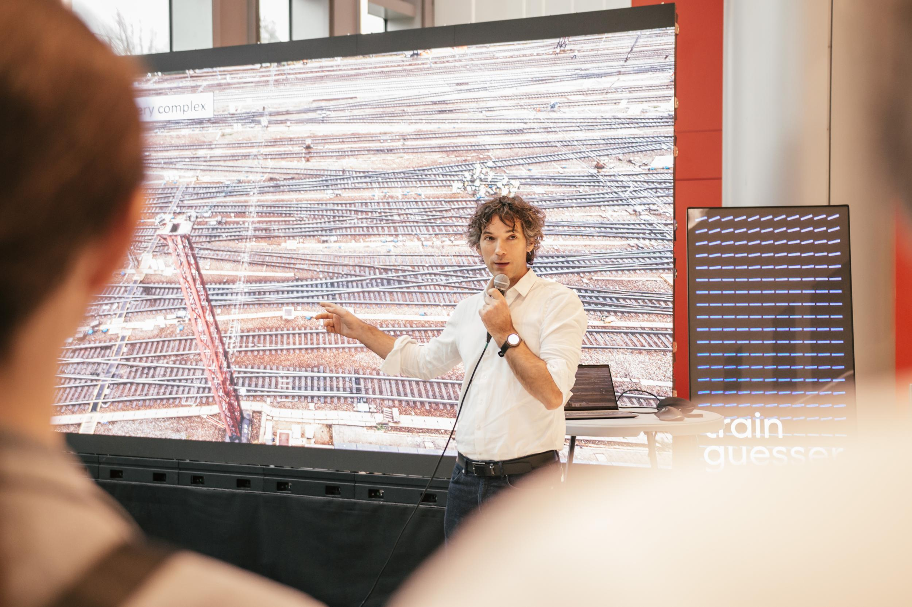
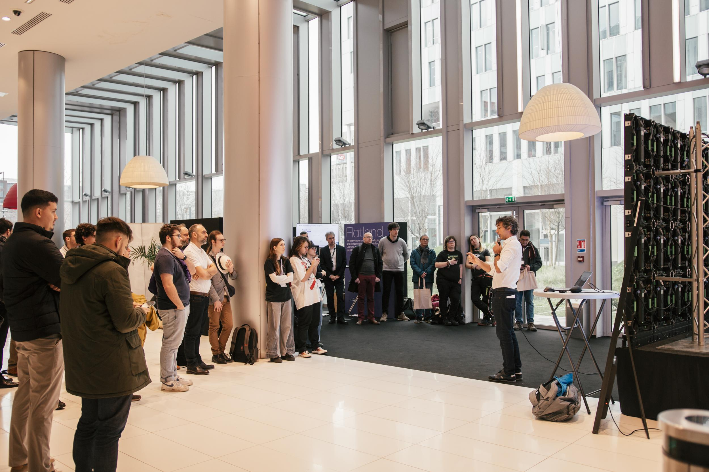

public:: true
type:: [[Talk]]
format:: Conference
audience-size:: 100
is-featured:: Yes
external-link:: https://day.openrailassociation.org/en
year:: 2025
during-job:: #[[Job: Independent railway data freelancer]]

- Presented [[TP-Lib]] during OpenRail Day @ Paris, in the context of the OpenRail ecosystem and its focus on open-source railway interoperability.
- Positioned the library as an open source approach for railway GNSS post-processing, train path calculation, and review workflows.
- Event context: the first public OpenRail Day, bringing together technical, institutional, and industrial stakeholders around open standards and open source in rail.
- Related initiative: #Openrail
- 
- 