public:: true
type:: [[Project]]
description:: A measurement systems deployed on about 15 commercial vehicles. The purpose is to detect shocks happening due to pantograph/catenary interaction. The measurement system consists of accelerometers on the pantograph head on high voltage and a low voltage system inside the train. Both communicate wirelessly. Every shock is transmitted and analysed by a server side centrally and self developed system. The biggest innovation is the method used for grouping the alerts. The location associated with the shock depends on the placement of the GNSS antenna compared to the pantograph head and on the orientation of the vehicle. Several other business rules are important as well to make this, relatively big data system, business usable. But at the end of project, it became fully integrated with the work management system and workorders were automatically created when possible.
has-category:: Measurement system
has-tagged-techniques:: [[C#]], #GNSS, #Git, #[[Gitlab CI CD]], #Railway, #RTM, #Topology, #Openshift, #GIS, #QGIS, #PowerBI, #Qlikview, #Accelerometers, #Quartz, #Firewall, #SSH, #Loki, #PostGIS, #Plpgsql, #Serilog
has-tagged-roles:: #[[Project lead]], #Developer, #Technician, #[[Business analyst]], #[[Data analyst]], #[[Data architect]]
has-linked-projects:: #[[Linear measurement data viewer]], #[[Contact wire uplift measurement system]], #[[Location measurement system for measurement train]]
is-featured:: Yes
during-job:: #[[Job: engineer overhead contact lines]]

- Integration with WMS
- 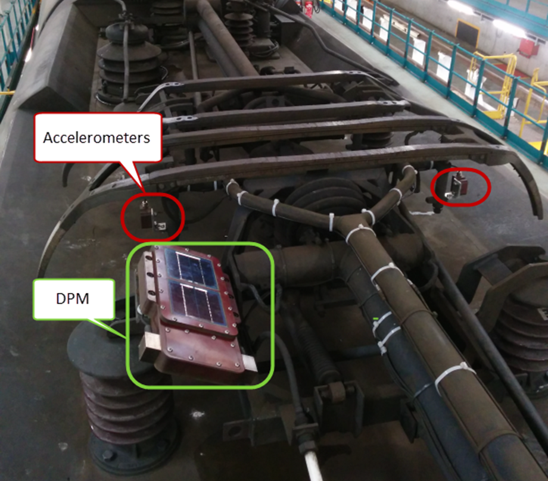
- 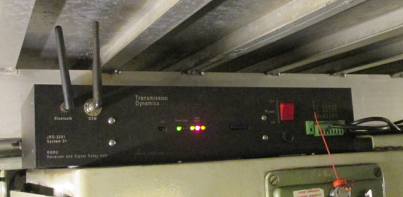
- 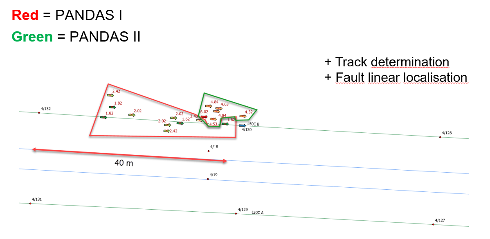
- 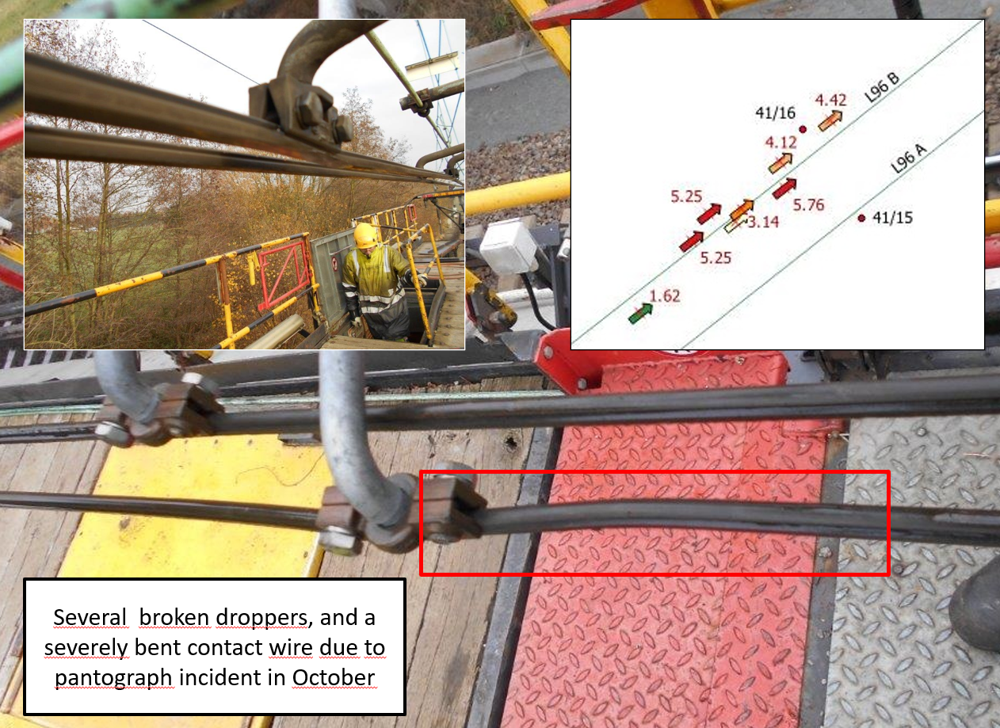
- 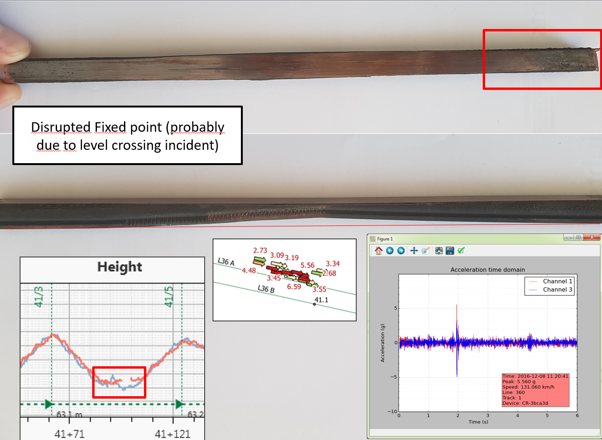
- 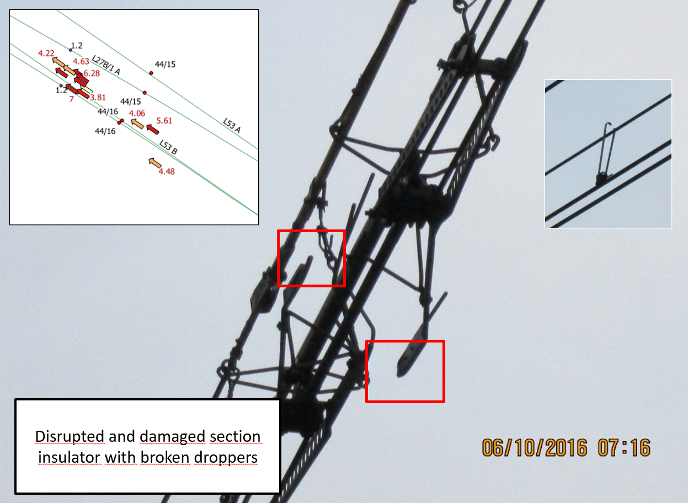
- 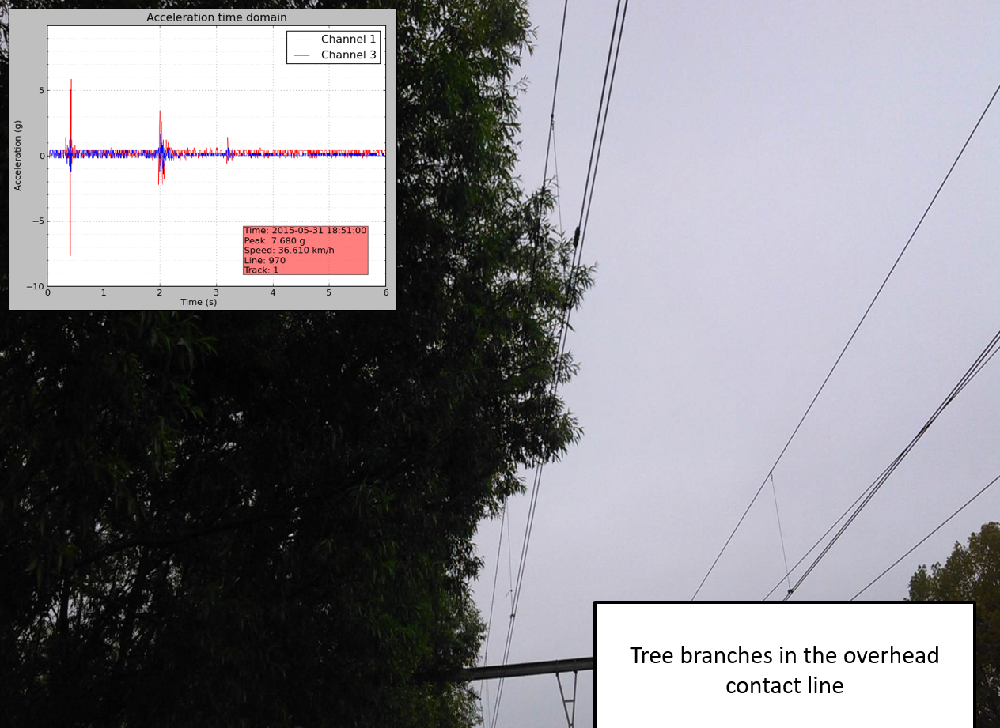
- 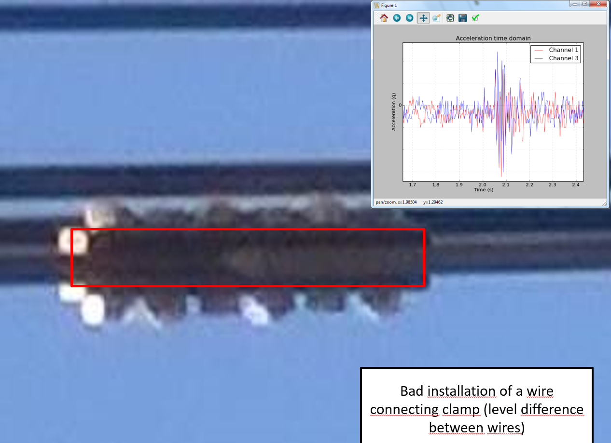
- 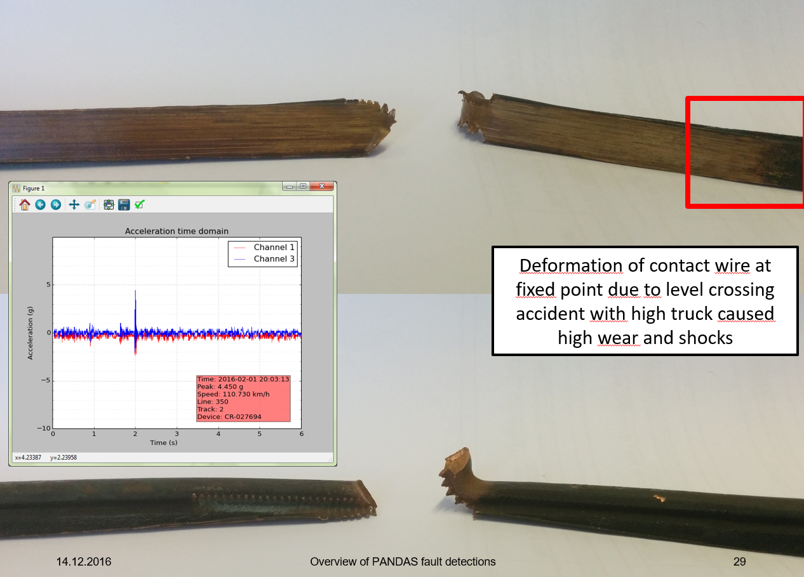
- 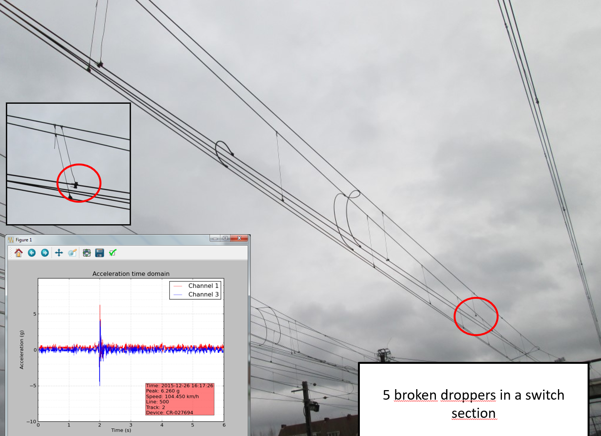
- 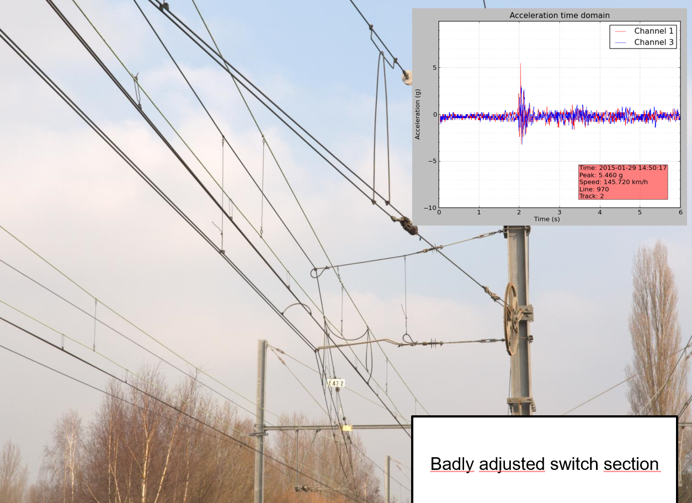
- 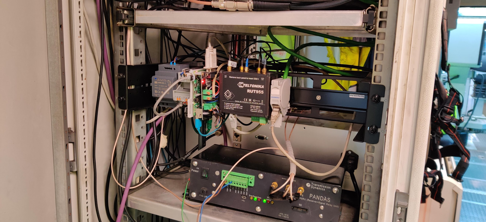