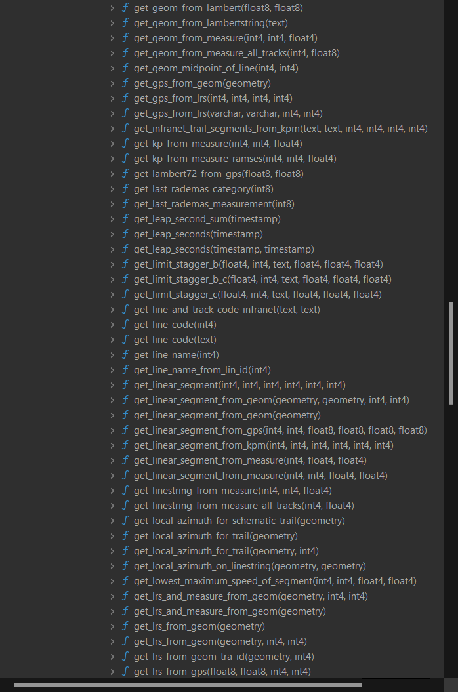
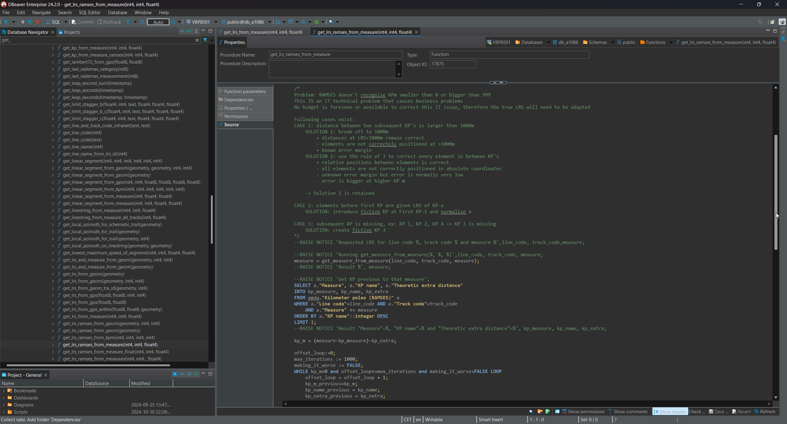

public:: true
type:: [[Project]]
description:: The goal of the project was a set of database functions to allow conversion between geographic coordinates, schematic coordinates, intrinsic coordinates and linear referencing (LRS) coordinates. Not only for points but also for linear segments and area's. 
has-category:: Data processing
has-tagged-techniques:: #Postgresql, #PostGIS, #PgRouting, #Git, #Topology, #LRS, #GIS, #PL/pgSQL, #RTM, #Railway 
has-tagged-roles:: #Developer, #[[Data architect]], #[[Data analyst]], #[[Project lead]] 
has-linked-projects:: #[[Post processing of binary linear measurement file]], #[[Linear measurement data viewer]] 
is-featured:: Yes
during-job:: #[[Job: engineer overhead contact lines]]

- 
- 