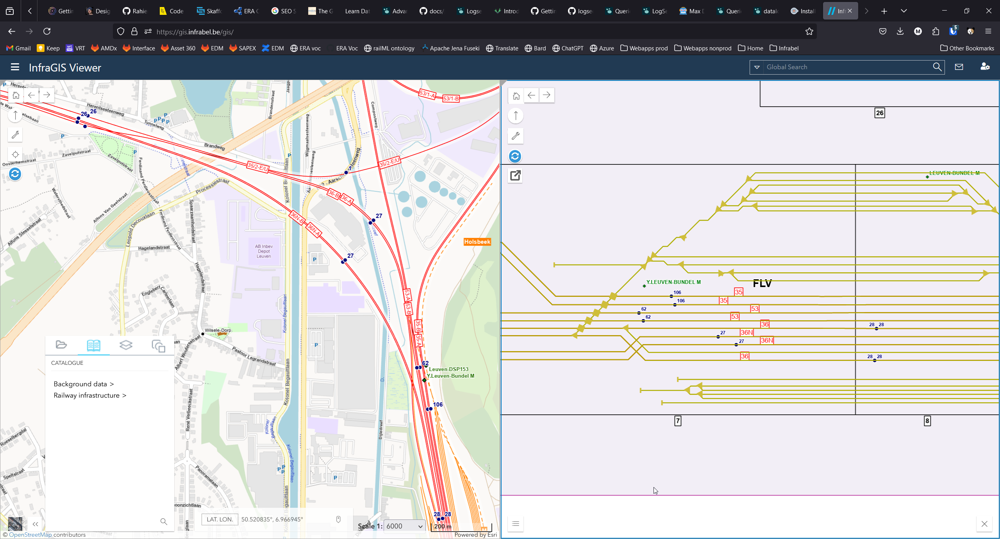
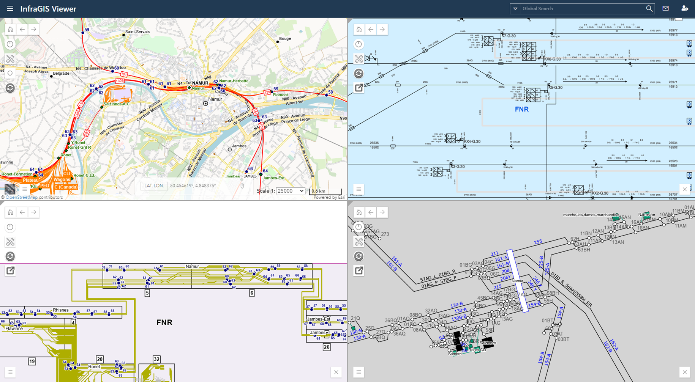
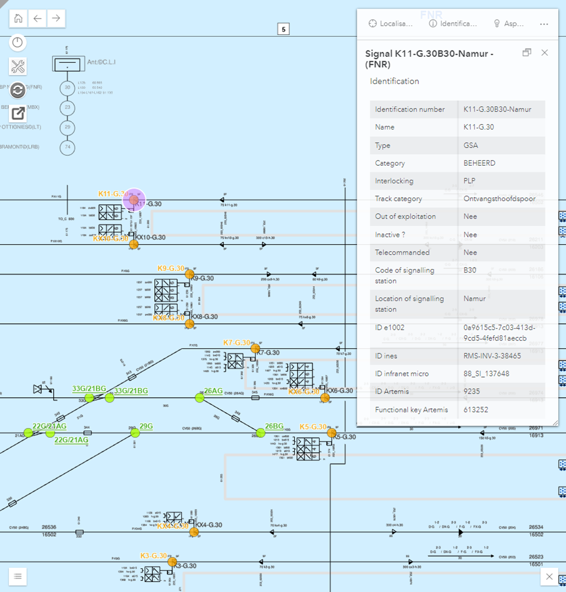

public:: true
type:: [[Project]]
description:: Ensuring the proper usage of resources. Building the right things. Having a complete and clear roadmap.
has-category:: Strategy
has-tagged-techniques:: #ESRI, #Jira, #QGIS, #Oracle, #PostGIS, #RTM, #[[Project management]] 
has-tagged-roles:: #Teamlead, #[[Project lead]], #[[Data architect]] 
has-linked-projects:: #[[Topologie to be]], #[[Product owner: railway micro-topology management platform]] 
is-featured:: Yes
during-job:: #[[Job: Teamlead data centricity]]

- 
- 
- 