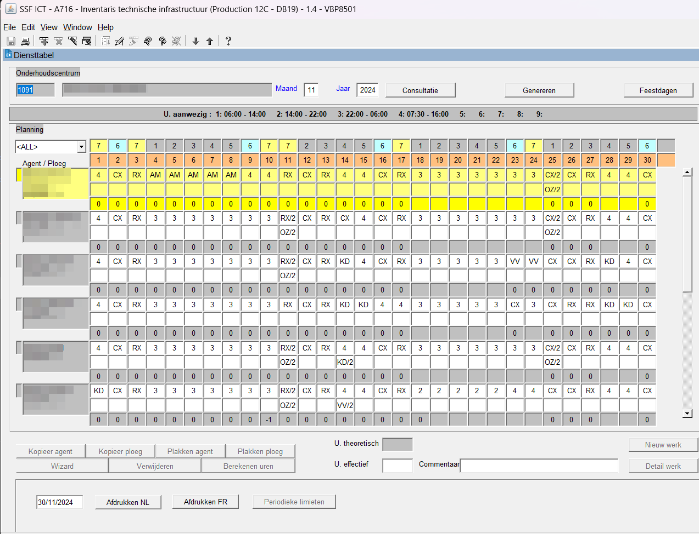
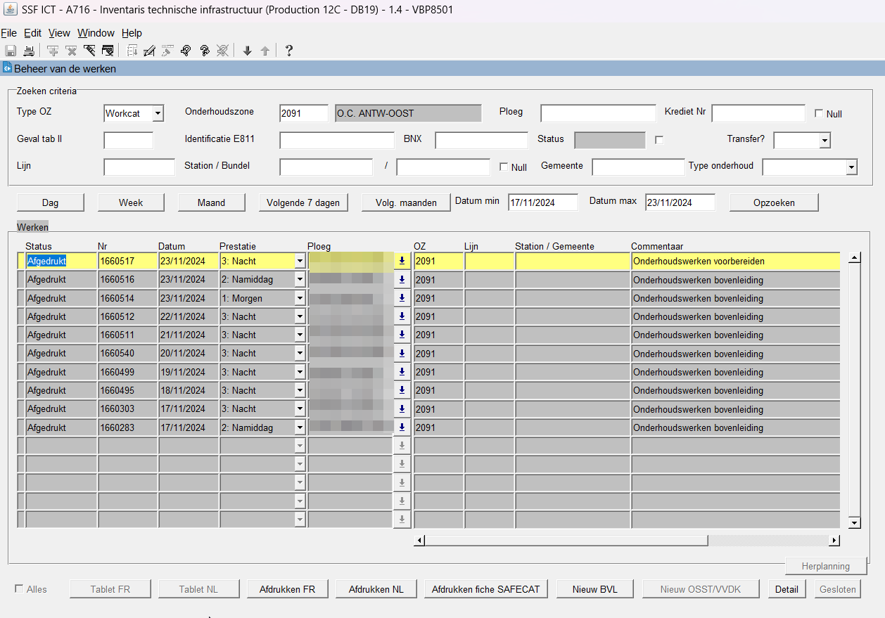

public:: true
type:: [[Project]]
description:: A work management systems allows the planning of workorders and is necessary to lower the administrative burden on technicians. The system has a time table (dates as columns and people as rows) for availability planning, an inventory with maintenance requirements, an incident reporting environment and a workorder system to link everything together. The system requires many types of reporting and interfacing with other systems.
has-category:: Strategy
has-tagged-techniques:: #[[Oracle Forms]], #Oracle, #Qlikview, #Git, #[[Project management]], #[[SAP CO]], #[[SAP PM]], #[[SAP CATS]] 
has-tagged-roles:: #[[Project lead]], #[[Product owner]], #[[Business analyst]], #[[Data analyst]] 
has-linked-projects:: #[[OCL maintenance KPI's]], #[[Model for FTE calculation of OCL technicians]] 
is-featured:: Yes
during-job:: #[[Job: engineer overhead contact lines]]

- 
- 