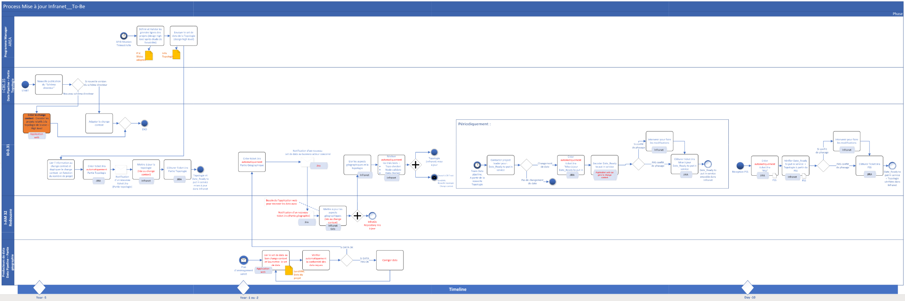

public:: true
type:: [[Project]]
description:: The goal of the project was to ensure that micro topology data was available at the time of creation, many years before the topology change would get into service. For this a new business process needs to be put in place with enhanced tooling. The result would be an increased data centric foundation. The design process for new equipment is not well connected with the micro topology since the AS IS topology is insufficient for them. Publishing the TO BE micro topology data would allow them to position the new assets already on the correct topologic location. That will give a snowball effect of data centric benefits.
has-category:: Business process
has-tagged-techniques:: #[[Data centricity]], #Topology, #RTM, #Jira, #Git, #[[AutoCAD suite]] 
has-tagged-roles:: #[[Project lead]], #[[Business analyst]], #[[Data architect]] 
has-linked-projects:: #[[Product owner: railway micro-topology management platform]], #[[Data centric strategy]], #[[Business process for track tracé data delivery]], #Asset360 
is-featured:: Yes
during-job:: #[[Job: Teamlead data centricity]]

- 
- 