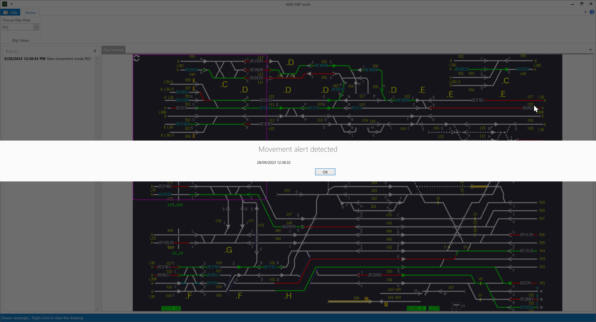
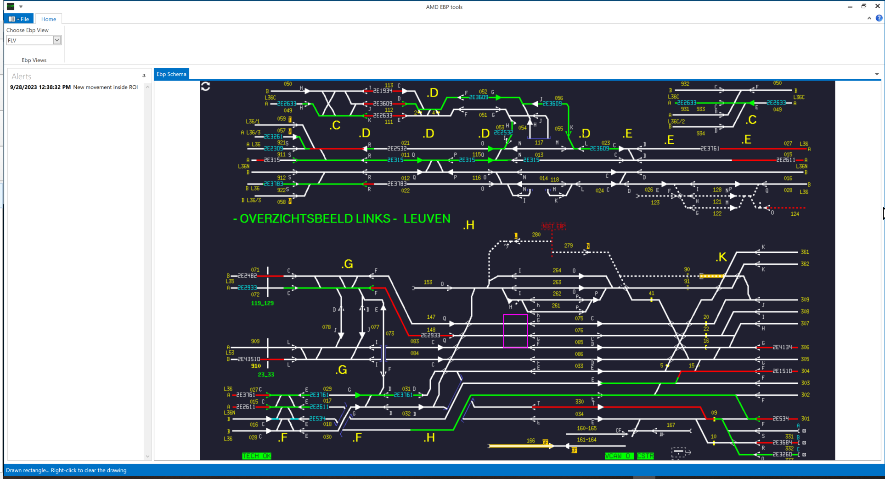
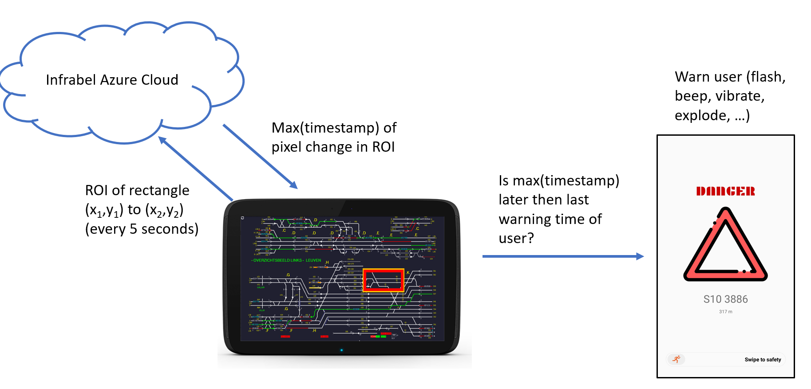

public:: true
type:: [[Project]]
description:: A desktop application that interfaces with the traffic management system to show the location of trains on a screen. The user can then select an area for which he wants to be warned if a train enters this place. The system will scan the image and when pixels change, alert the user.
has-category:: Desktop app
has-tagged-techniques:: #[[C# .NET]], #ClickOnce, #Railway, #Git, #[[Gitlab CI CD]], #OpenCV, #Serilog 
has-tagged-roles:: #[[Project lead]], #[[Data architect]], #[[Business analyst]] 
has-linked-projects:: #[[GPS trackers for mobile safety equipment]] 
is-featured:: No
during-job:: #[[Job: Project lead SMILE 2.0]]

- 
- 
- 