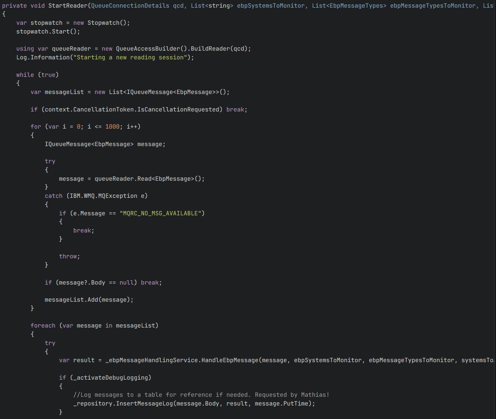
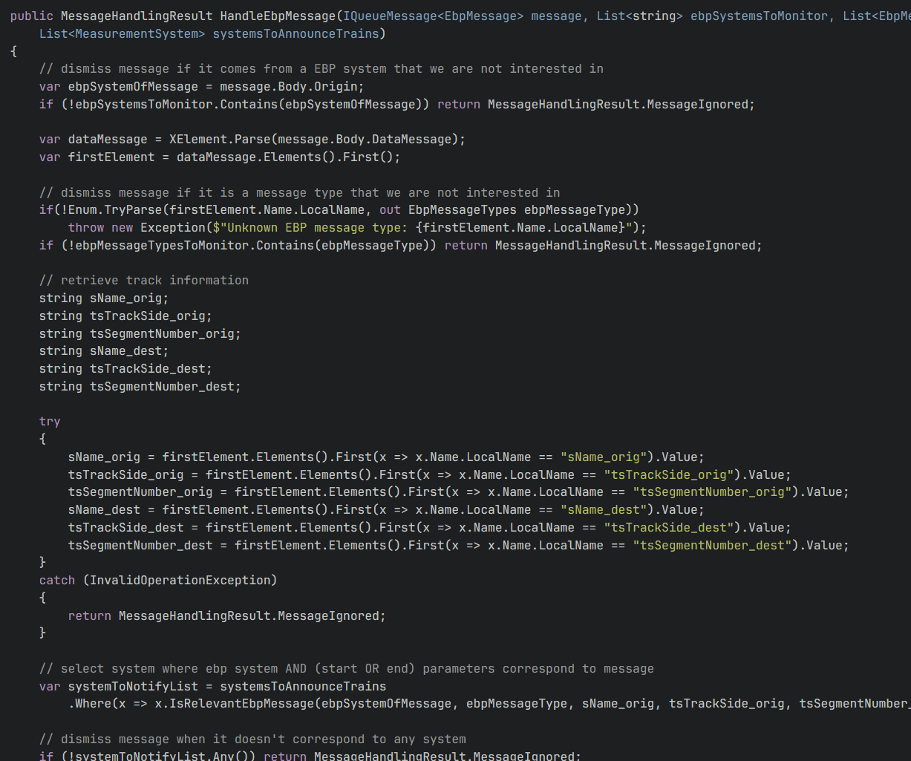

public:: true
type:: [[Project]]
description:: A backend system using the train detection system to announce the train number to measurement systems. The train detection data arrives on a message queue, this queue is continuously read and processed for relevant messages. When train enters or exists a zone with a measurement system, the announcer will send this data to the measurement system. The measurement system uses this information for immediate action (pulling the train aside) or predictive actions (worn carbon of the pantograph).
has-category:: Data processing
has-tagged-techniques:: [[C#]], #[[IBM MQ]], #SSH, #Openshift, #Git, #[[Gitlab CI CD]], #Postgresql, #Dbeaver, #PowerBI, #Quartz, #Serilog
has-tagged-roles:: #Developer, #[[Data architect]], #[[DevOps engineer]]
has-linked-projects:: PantoCAM, Numberfinder
is-featured:: Yes
during-job:: #[[Job: engineer overhead contact lines]]

- 
- 