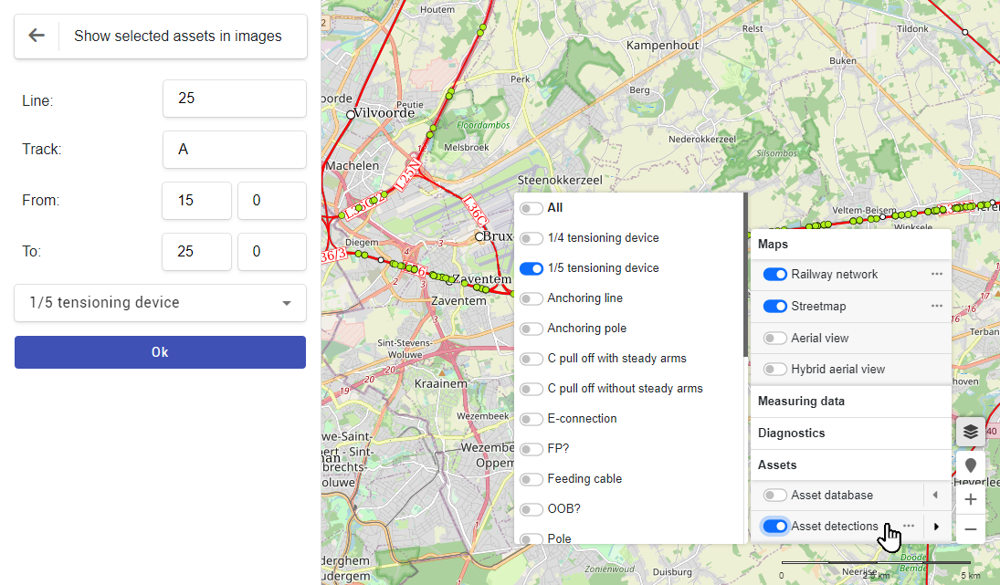
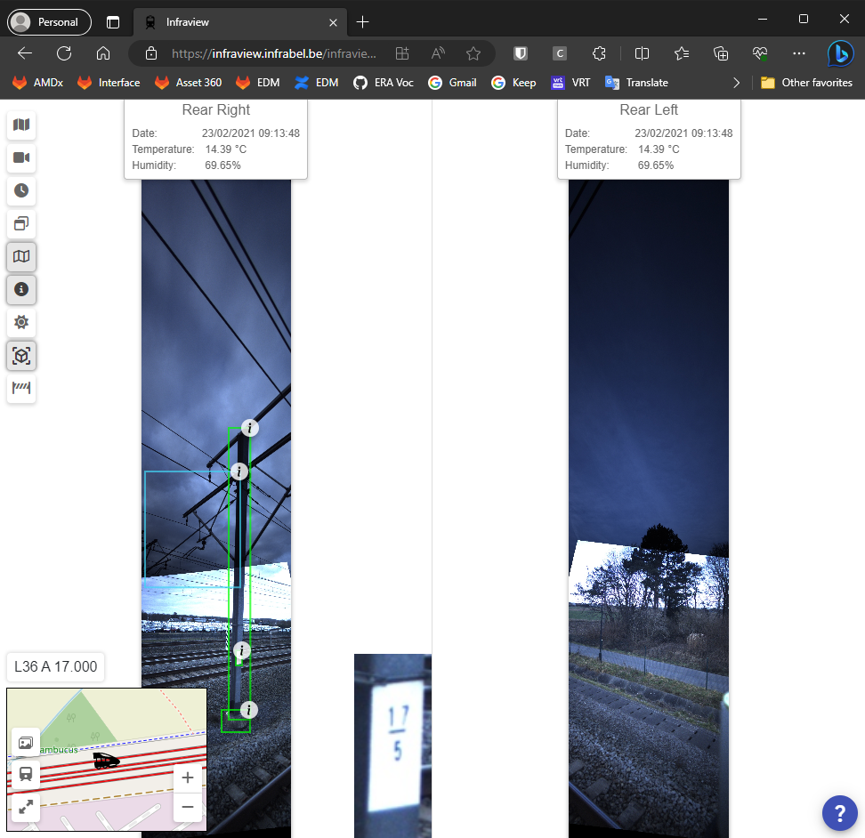
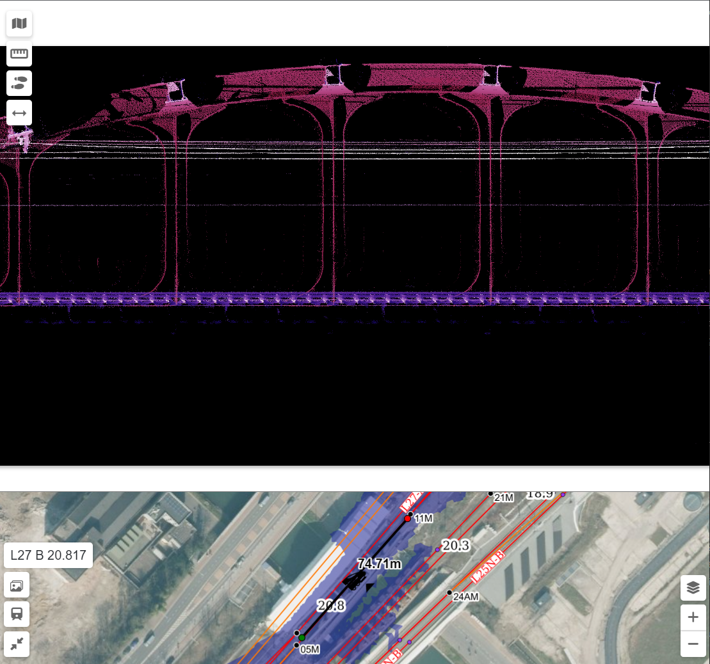

public:: true
type:: [[Project]]
description:: The goal of the project is to create a webapp that allows users to perform a digital inspection of the railway infrastructure. The app is GIS based, it shows the railway network and works very similar to Google streetview. The user clicks a location and can look around. Features are available to annotate the location. AI detections and Lidar interaction is also possible.
has-category:: Webapp
has-tagged-techniques:: #GIS, #Angular, #Git, #[[Gitlab CI CD]], #[[C# .NET]], #[[JSON API]], #PostGIS, #Postgresql, #Dbeaver, #SQL, #Plpgsql, #Nginx, #[[Reverse proxy]], #Serilog, #Loki, #Railway, #Lidar, #WMS
has-tagged-roles:: #[[Business analyst]], #[[Data architect]], #[[Project lead]]
has-linked-projects:: #[[Image recognition AI]], #[[Image indexing services]], #[[Measurement train image post processing]], #[[PostGIS: GIS to LRS calculation library]], #[[Post processing of binary linear measurement file]], #[[Lidar vegetation detection]], #[[Linear measurement data viewer]]
is-featured:: Yes
during-job:: #[[Job: Project lead digitalisation linear assets]]

- 
- Features
	- GIS map with assets from inventory and #JARVIS AI detected assets
	- See images from several perspectives
	- Search assets and location
	- Search all detected assets of a certain type on a line
	- Create LIDAR sections
	- Pole name cut out & size increase
- Screenshots
	- 
	- 
	- 
	-