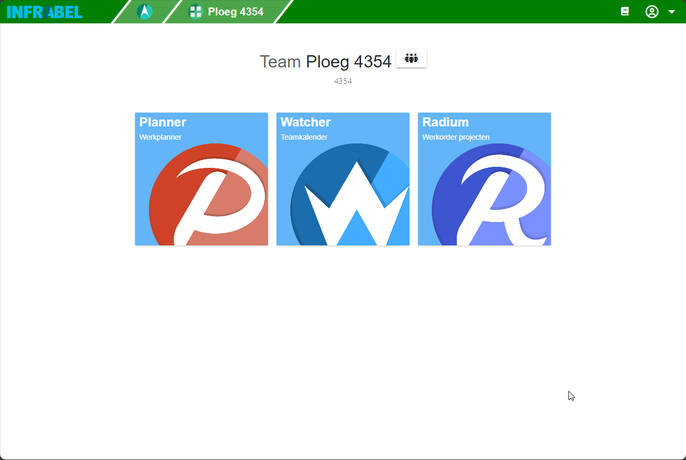
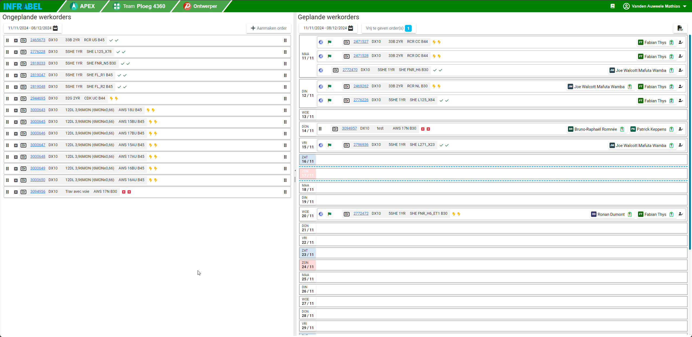
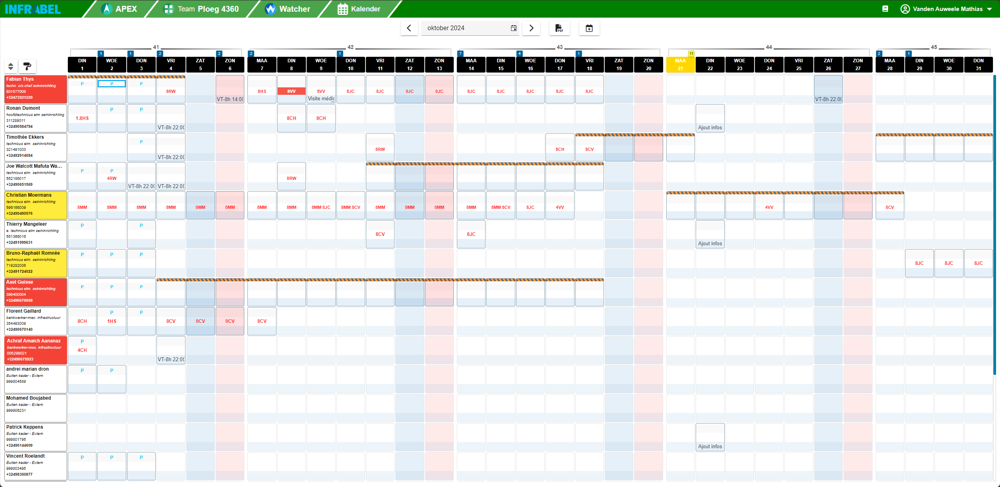
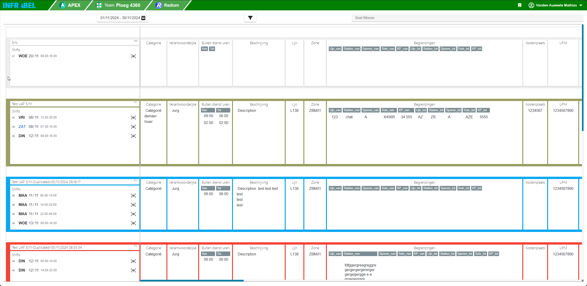

public:: true
type:: [[Project]]
description:: SAP is not a very user friendly system. The available tools to perform planning of workorders are insufficient for railway purposes. Thus a new web application was designed and interfaced with SAP backend. This project is part of a "planningtools" program to improve the business process and optimise the use of resources.
has-category:: Planningtool
has-tagged-techniques:: #[[SAP PM]], #[[C#]], #Azure, #Logseq 
has-tagged-roles:: #[[Project lead]], #[[Data architect]]
has-linked-projects:: #[[Out of service planning consolidation system]]
is-featured:: Yes
during-job:: #[[Job: Teamlead data centricity]]

- 
- 
- 
- 