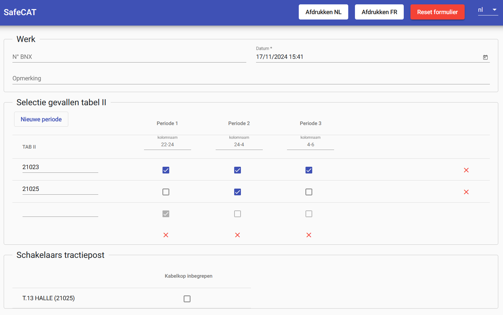

public:: true
type:: [[Project]]
description:: The goal was to replace an old fashioned system with technical limitations (certainly concerning interfacing and access) with a modern web application. The application consists of an API that returns "dangerous places" and other sectioning information of the overhead contact line. The web application allows to easily query the API and print a pdf.
has-category:: Webapp
has-tagged-techniques:: #Openshift, #[[C# .NET]], #[[JSON API]], #Git, #Angular, #[[Oracle Forms]] 
has-tagged-roles:: #Developer, #[[Data architect]], #[[Business analyst]], #[[DevOps engineer]] 
has-linked-projects:: #[[Out of tension digital request system]] 
is-featured:: Yes
during-job:: #[[Job: Project lead digitalisation linear assets]]

- 