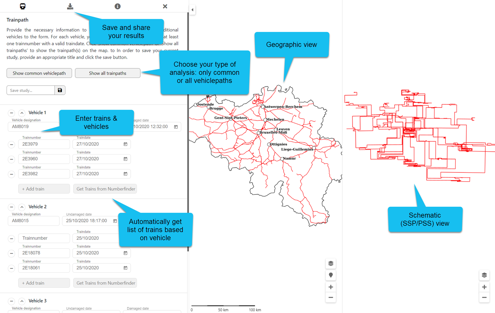

public:: true
type:: [[Project]]
description:: Sometimes, multiple railway vehicles are discovered with damages on the same location, for example 30cm out of center of the pantograph. This is a clear sign of an infrastructure issue. In order to narrow down the location of the infrastructure problem, the train paths are visualised on a map that is common to all the vehicle. The challenging part of this project is to find a sufficiently detailed trainpath and a relation between the vehicle and the trains in which it served.
has-category:: Webapp
has-tagged-techniques:: [[C#]], #Git, #[[Gitlab CI CD]], #Openshift, #Topology, #WMS, #Angular, #Nginx, #[[JSON API]], #PgRouting, #Docker 
has-tagged-roles:: #[[Project lead]], #[[DevOps engineer]], #[[Data architect]], #[[Business analyst]] 
has-linked-projects:: #[[Location post processing system for railway vehicles]], #[[Linear measurement data viewer]], #[[Pantograph shock detection system]]
is-featured:: Yes
during-job:: #[[Job: engineer overhead contact lines]]

- 