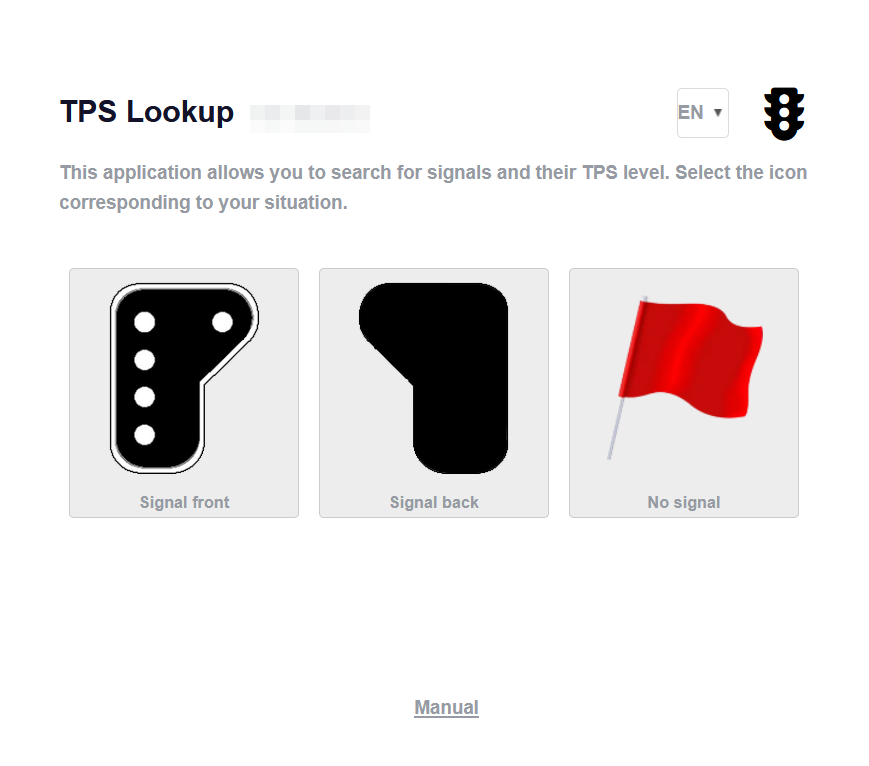
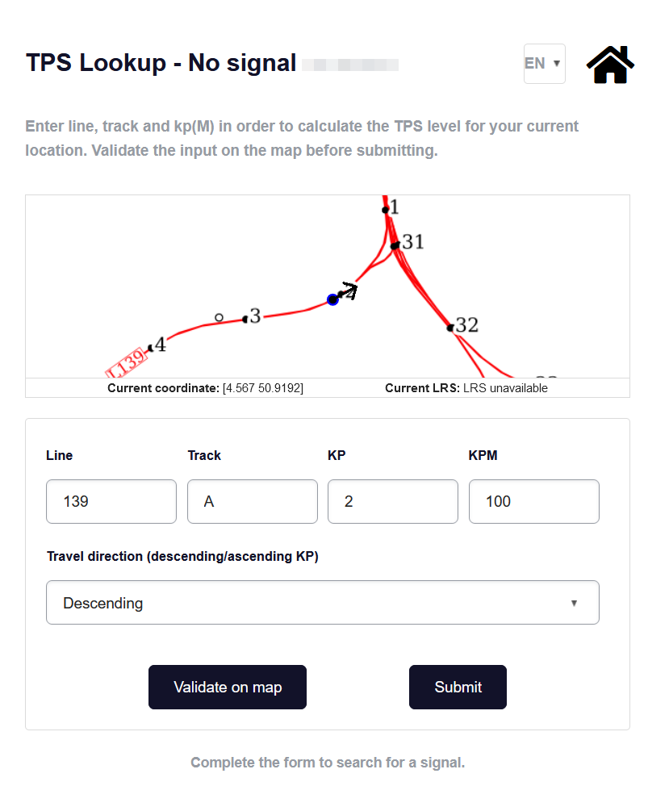
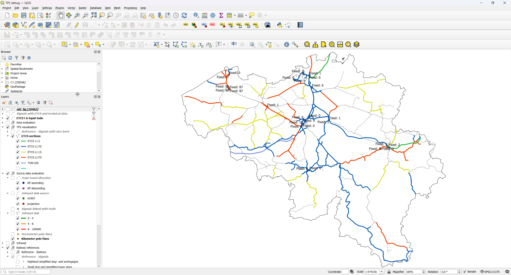

public:: true
type:: [[Project]]
description:: A (work)traindriver that comes out of a track out of service, needs to configure his vehicle to the correct TPS system (TBL1+ or ETCS L1 LS, L1 FS, L2). This webapp allows the driver to correct locate himself on the track topology, using either a signal or his GPS position and give a driving direction. The app will then calculate the TPS level. The challenge of this project was to inventorise the TPS systems on the topology and create a routing algorithm using business logic to find "the next signal" on the trainpath, returning multiple if applicable. The TPS inventory is also used as an opendata dataset.
has-category:: Webapp
has-tagged-techniques:: #Openshift, #Git, #[[C# .NET]], #[[JSON API]], #Angular, #GNSS, #Firewall, #[[Reverse proxy]], #Openshift, #ADFS, #PgRouting, #PostGIS, #QGIS, #Git, #Docker, #[[Gitlab CI CD]], #ADFS 
has-tagged-roles:: #[[Project lead]], #[[DevOps engineer]], #[[Business analyst]], #[[Data architect]] 
has-linked-projects::
is-featured:: Yes
during-job:: #[[Job: Project lead digitalisation linear assets]]
external-link:: https://opendata.infrabel.be/explore/dataset/geo-etcs/information/?disjunctive.etcs_level&disjunctive.line_name_input

- Signal data integration from multiple system for topology
- 
- 
-
- 